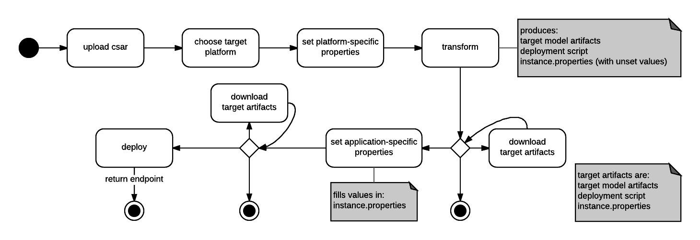
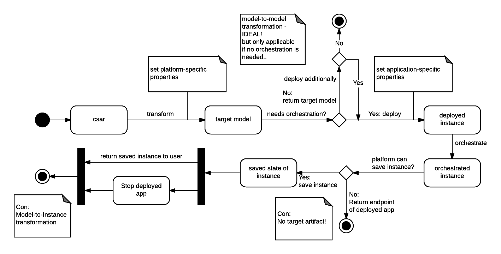
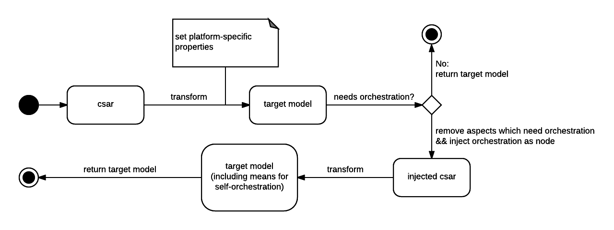

# Transformation workflow

This document describes the current transformation workflow.
Older versions are described afterwards.

## Current Flow

##### Which problems have been solved with this design?
- This design keeps the simplicity (regarding the implementation of the transformation module) of the first design idea and combines it with the flexibility (regarding output files) of the second one.  
- The plugins will always produce three kinds of output when transforming: First, the target model artifacts itself (e.g.: Cloud Formation Template and Deployment Artifacts).  
Then, the `instance.properties` text file. It contains keys of required properties at deploy time (note: the values are unset).
Last, they produce a deployment script `deploy.sh` which contains deployment and orchestration logic. When executing this script, it first sources the `instance.properties` text file, then deploys and orchestrates the app.
    - This approach enables the user to transform any supported csar, then download the resulting artifacts and deploy at any given time with lightweight dependencies (transformer not required, only dependencies are shell & basic unix tools & targetPlatform-specific tools).
    - However, the user still has the possibility to declare his application-specific properties and deploy the app via the GUI / CLI. Note that internally, the above mentioned `instance.properties` file is filled with values and the `deploy.sh` script is executed.

## Older versions

### First idea

Problem: Transformations which need orchestration to be considered complete did not produce a complete target model artifact.
### Second idea

Problem: The flow itself is fine; this should be the way to go. Unfortunately, this approach was considered too complex for our project by the client.
Note: One would not add a node (aka Management Node) to the template, but rather add management operations to the tosca template.

