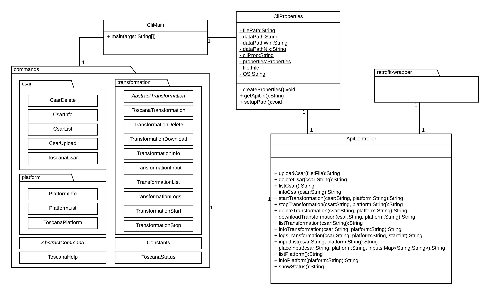

# Definition CLI Architecture
This document describes the architecture for the CLI component of the TOSCAna Software.

## Class Diagram

***Note:*** This diagram was created using LucidChart. The source file can be found [here](https://www.lucidchart.com/invitations/accept/6c4ca4c7-d79a-4fee-82ba-6a79e2971f39).

## ApiController
The ApiController trys to perform the tasks it receives from the CliController and calls the corresponding methods of the REST API.

The methods shown in the above class diagram have the following functionality:
* `uploadCsar(file: File):String` - trys to upload the specified CSAR Archive to the Transformator
* `deleteCsar(csar: String):String` - deletes the specified CSAR Archive from the Transformator
* `listCsar():String` - lists all available CSAR Archives on the Transformator, which can be used for a Transformation
* `infoCsar(csar: String):String` - shows detailed Information about the specific CSAR Archive
* `startTransformation(csar:String, platform:String):String` - starts a Transformation of the passed on CSAR Archive to the specified Platform
* `stopTransformation(csar:String, platform:String):String` - stops a currently running Transformation
* `deleteTransformation(csar:String, platform:String):String` - deletes an available Transformation from the Transformator
* `downloadTransformation(csar:String, platform:String):String` - downloads an available Transformation Artefact from the Transformator
* `listTransformation(csar:String):String` lists all available Transformations on the Transformator
* `infoTransformation(csar:String, platform:String):String` - shows detailed Information about the specific Transformation
* `logsTransformation(csar:String, platform:String, start:int):String` - prints available Logs for the Transformation, starting at the provided start point
* `inputList(csar:String, platform:String):String` - returns a list of required inputs that need to be set, before a transformation can start
* `placeInput(csar:String, platform:String, inputs:Map<String,String>):String` -  Sets the required Inputs, Inputs can be provided manual or from a file with properties like formatting
* `listPlatform():String` - lists all Platforms that are available for a Transformation
* `infoPlatform(platform:String):String` - shows detailed Information about the specific Platform
* `showStatus():String` - shows the current state of the System

## CliMain

The **CliMain** is the main class to initialize the CLI and show the possible commands, subcommands or options that can be executed in the CLI. After the user has made a correct commandline input, the CliController trys to call the corresponding classes which run the methods.

## CliProperties

The **CliProperties** class, creates a cli.properties config file if it doesn't exist and returns the API Url that is used to call the REST API.

## Commands Package
The **commands package** contains several classes and three packages: csar, platform and the transformation package. The packages and classes are mandatory to create the Picocli components for the CLI.
ToscanaHelp shows the Help Page of the CLI, ToscanaStatus the status of the System and AbstractCommands contains the Options that are used from most of the classes.
For more detailed Information about the commands and subcommands view [`cli-commands.md`](cli-commands.md).

## Restclient Package
The **restclient package** contains the Interface class RestClient and the model package containing Modelclasses which are needed for parsing the JSON back to Java Objects.

## License

Copyright (c) 2017 University of Stuttgart.

All rights reserved. Made available under the terms of the [Eclipse Public License v1.0] and the [Apache License v2.0] which both accompany this distribution.

 [Apache License v2.0]: http://www.apache.org/licenses/LICENSE-2.0.html
 [Eclipse Public License v1.0]: http://www.eclipse.org/legal/epl-v10.html