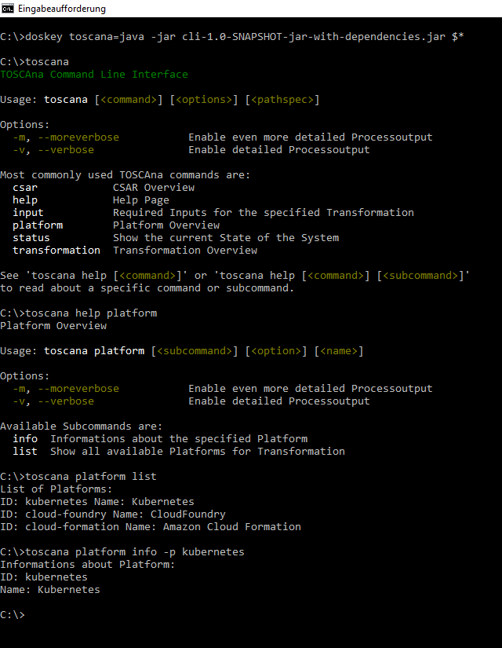

## Build the CLI from Source
Steps to build the **TOSCAna Command Line Interface** from sources:
1. Clone the project.

    `
    git clone https://github.com/StuPro-TOSCAna/TOSCAna.git
    `

2. Enter the cli directory.

    `
    cd TOSCAna/cli
    `

3. Build the project with:

    `
    mvn package
    `

4. You can find the generated jar file `cli-1.0-SNAPSHOT-jar-with-dependencies.jar` in the target folder.

## Usage
How to use **TOSCAna CLI**:

1. Create an Alias `toscana` on Unix Systems or an Doskey `toscana` on Windows Systems for easier usage:

	Unix:
	`
    alias toscana="java -jar $(readlink -f cli-1.0-SNAPSHOT-jar-with-dependencies.jar)"
    `

	Windows:
	`
    doskey toscana=java -jar cli-1.0-SNAPSHOT-jar-with-dependencies.jar $*
    `

2. You can now use the **TOSCAna CLI** with the commands below.

	`
    toscana [<available commands>]
    `

## CLI Basics

The main tasks of the CLI are:
- parse and call the commands
- call the methods to transform a given topology to a custom platform
- show current status of transformation/ deployment
- print detailed logs for the transformation if wanted
- show supported platforms

## Supported Commands, Subcommands and Options

Every command and subcommand has these options available: `-v` or `--verbose` and `-m` or `--moreverbose`, parameters of commands are represented as `<name>`. Some other available Options are: `-c` or `--csar`, `-f` or `--file`, `-p` or `--platform` and `-t` or `--transformation`, in the table below you can see where which of these commands is accepted.

If you set the Alias `toscana`, you have to type `toscana` and then the command(s) before you can call a Command or Subcommand. At the end of the Document an example usage of the CLI for Platform Informations is shown.

Options explanation:
- `csar`: specifies a CSAR which is available
- `file`: specifies a file that should be used or uploaded
- `platform`: which platform is needed for operation
- `transformation`: short version for input of csar and platform, csar and platform are seperated with a `/`, therefore slash is not allowed in both parameters
- `verbose`: enable some output about what is processed
- `moreverbose`: enables even more detailed output what is processed

| Command | Description |
| ------- | ----------- |
| `csar`| show csar usage and all available subcommands |
| `csar upload -f <csarpath>` | uploads a specific CSAR Archive to the Transformator |
| `csar list` | shows a list of all available CSARs on the Transformator |
| `csar info -c <csarname>` | shows detailed Informations for the specified CSAR |
| `csar delete -c <csarname>`| deletes the specific CSAR from the Transformator |
| `help [<command>] [<subcommand>]` | prints the usage page for specified command or subcommand |
| `input -c <csarname> -p <platformname>` or `input -t <csarname/platformname>` | returns all required Inputs that need to be set, before a transformation can be started |
| `input -c <csarname> -p <platformname> <key/value>` or `input -t <csarname/platformname> <key=value>` | manual setting of inputs with <key=value> style notation, `=` not allowed in the inputs |
| `input -c <csarname> -p <platformname> -f <filepath>` or `input -t <csarname/platformname> -f <filepath>` | setting the inputs with a provided file, format of each line in the file: key="value" |
| `platform` | show platform usage and all available subcommands |
| `platform list` | shows a list of all for Transformation available Platforms |
| `platform info -p <platformname>` | shows detailed Informations for the specified Platform |
| `status` | shows the current state of the System |
| `transformation` | show transformation usage and all available subcommands  |
| `transformation start -c <csarname> -p <platformname>` or `transformation start -t <csarname/platformname>` | start a Transformation for the specific CSAR  to the wanted Platform |
| `transformation stop -c <csarname> -p <platformname>` or `transformation stop -t <csarname/platformname>` | stops the specified currently running Transformation |
| `transformation list -c <csarname>` | shows a list of all available Transformations of the specified CSAR |
| `transformation info -c <csarname> -p <platformname>` or `transformation info -t <csarname/platformname>` | shows detailed Informations for the specified Transformation |
| `transformation logs -c <csarname> -p <platformname>` or `transformation logs -t <csarname/platformname>` | shows logs created while running the transformation |
| `transformation download -c <csarname> -p <platformname>` or `transformation download -t <csarname/platformname>` | downloads the specific Transformation Artifact |
| `transformation delete -c <csarname> -p <platformname>` or `transformation delete -t <csarname/platformname>` | deletes the specific Transformation from the Transformator |

## Example Usage

***Note:*** Example usage of the CLI for Platform Informations

## Change API Endpoint
After you executed the CLI at least once, a config file named `cli.properties` can be found in the created toscana folder. There you can change the API Endpoint to fit your provided REST API Endpoint.

The folder can be found for Unix Systems at:
`$HOME/.config/toscana/`

For Windows Systems at:
`$HOME/AppData/toscana/`
If you can't find the folder on Windows, enter `%appdata%` in the explorer directory field or `cd %appdata%` in the Command Line and move from Roaming one folder level back to AppData.

## License

Copyright (c) 2017 University of Stuttgart.

All rights reserved. Made available under the terms of the [Eclipse Public License v1.0] and the [Apache License v2.0] which both accompany this distribution.

 [Apache License v2.0]: http://www.apache.org/licenses/LICENSE-2.0.html
 [Eclipse Public License v1.0]: http://www.eclipse.org/legal/epl-v10.html
