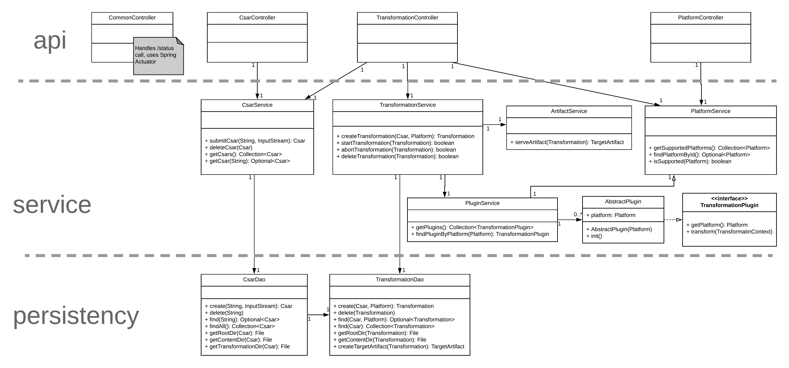
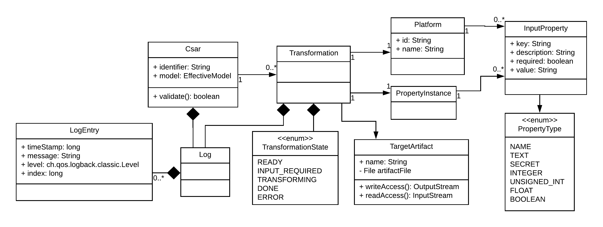
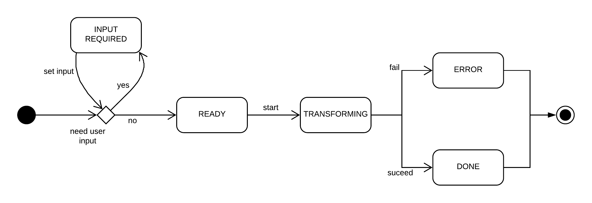

# Design

The Core component provides means for managing CSARs and transformations.
This includes uploading and deleting CSARs as well as creating, starting and deleting transformations.

>*Note: Some details have been omitted. 
Use this diagram to obtain a general idea of the core structure.*

[*fullsize*](img/core-design.png)

### Domain model

Following domain model is used within the core.

[*fullsize*](img/core-domain-model.png)

##### Logging
Logging is a first class citizen in the core domain model.
This is because we are serving transformation specific logs via the rest API.
Each logline gets cached in memory as well as written to the transformation specific log file. 
Note that we are not reimplementing logging; we've rather wrapped up [logback](https://logback.qos.ch/) to fit our needs.

##### Persistency
The filesystem is used directly to persist CSAR's and transformations (including the resulting transformation artifact). [Here's why](../adr/0015-persist-to-filesystem.md) we don't use a database instead.

File storage is structured in following way:

- *csars*
    - csar1
        - *content*: root directory of the unzipped CSAR
        - *transformations*
            - platform1
                - content: The transformation output
                - csar1-patform1.log: Log file of this transformation
            - platform2
            - ...
    - csar2
    - ...
- *misc*: Contains miscellaneous data

Modifying this data with external tools at runtime might result in unexpected behaviour. 
However, after a restart, the server will reflect the filesystem changes. 

##### Transformation state
The state of a transformation behaves as shown in following diagram:

User input is required exactly when the target platform of the transformation or the TOSCA service template has one or more required, unset input properties.
