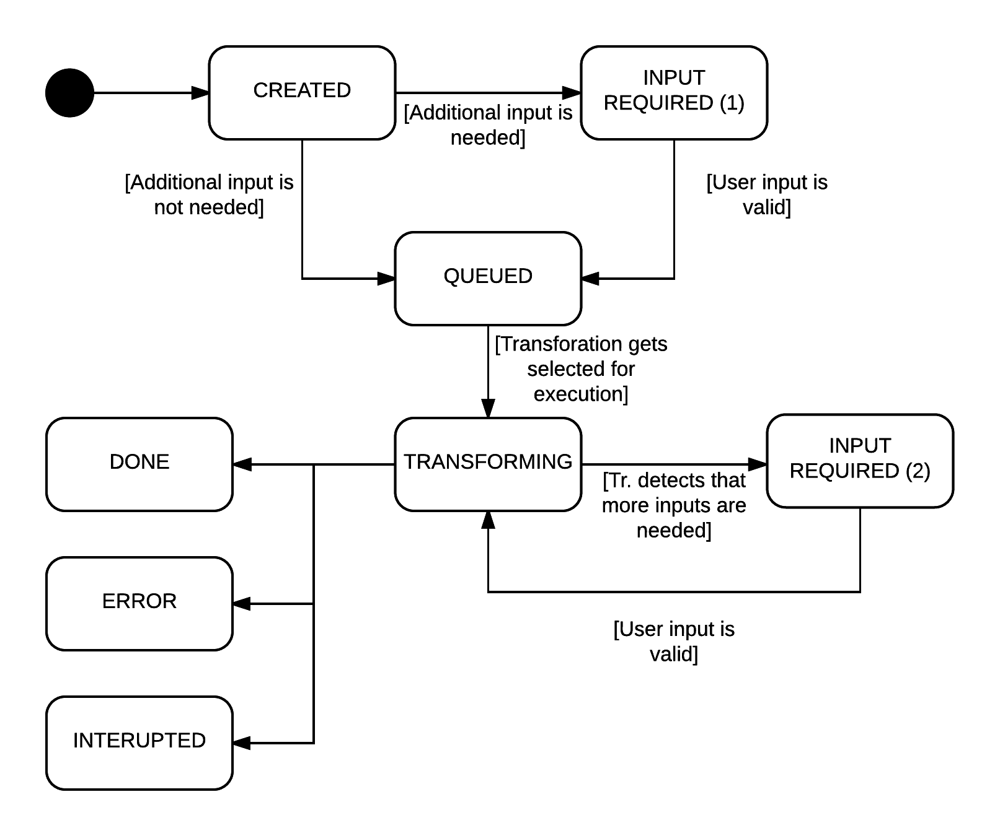

# Transformation states

The transformation object can be in different states, this document describes the possible states for of a transformation and what their meaning is.

## Transforming

### State diagram

### State Description

- `CREATED` - This is the default state of a transformation after it's creation. Once the transformation has been started by a asynchronous call the state changes to `QUEUED` or `INPUT_REQUIRED`.
- `INPUT_REQUIRED (1)` - This state illustrates, that input is needed in order to proceed with the transformation. Once the input is set and validated the state will change to `QUEUED`. If the input is invalid the State will stay on `INPUT_REQUIRED`.
- `QUEUED` - A transformation is in this state if the input (if required) has been validated and it it ready to be transformed, however the transformation has not been started yet!
- `TRANSFORMING` - When a transformation is in this state the transformation is being executed (it is running)
- `INPUT_REQUIRED (2)` - Similar to the first version of this, however this state occurs if the transformer detects needed properties during the execution of the transformation.

End States:
- `ERROR` - While transforming a exception/error has occured. To restart the transformation has to be deleted and started again.
- `INTERRUPTED` - The transformation has been stopped by the user. It behaves equally to the `ERROR` state
- `DONE` - The transformation has finished with no errors. The target artifact can be downloaded again

## Deployment

To be Done!
