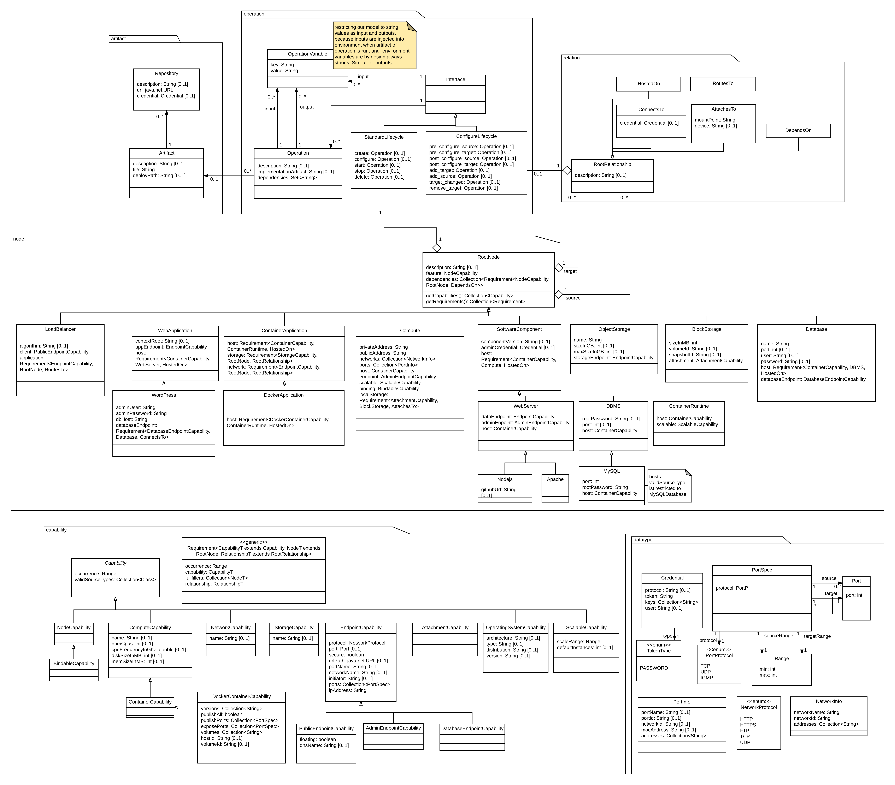

# Effective model

We need a common model that represents the topology of a CSAR. This model shall be used by the plugins to execute the transformation.

The model generated by the winery parser (`TServiceTemplate`) is not suitable for this task, as it describes the meta model of the topology. Using the meta model to transform an topology is rather tedious. Goal of the `EffectiveModel` is to provide a more suitable model for given purpose. When categorizing the `TServiceTemplate` as the meta model, the `EffectiveModel` is its instance model.

The model contains all normative and non-normative Types. The different Artifact Types however are not modeled. As they are neither referenced in Capability-, Relationsship- nor Node-Types I decided to give up on the distinction between artifact types (at least for now).

##### Differences to TOSCA Simple Profile
Currently not supported (& might never be):
- Networking
- Node Filter
- Node Groups
- Policies
- Workflows

