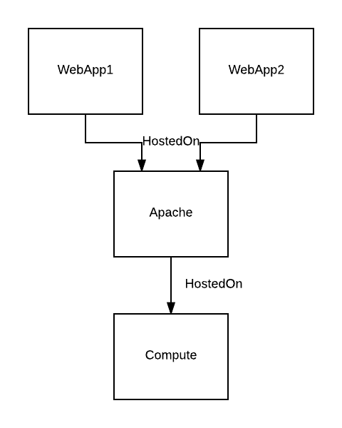

# NodeSorter

This document deals with a general node sorter that sorts nodes in the EffectiveModel in the order they should be deployed.

## Example

To demonstrate my ideas I use the following example model.

## Idea

Since sorting node by node makes no sense and in my oppinion all plugins need some kind of node stacks the best solution might be to find these node stacks and then sort them by the order thy should be deployed.

**NodeStack-Sorter Steps:**
1. Find node stacks
2. Sort node stacks

### 1. Step: Find node stacks

Since Step 1 is very important for the plugins I explain my three different ideas in the following.
In the moment I like Solution 1 the most but this needs still some discussion.

#### Solutution 1

In the first solution everything is packed in different node stacks so if there are two WebApp nodes with a HostedOn Relationship to a Apache two stacks will be generated, so the algorithm starts from bottom, collects the "top" level nodes then goes back downwards for each of these "top" nodes and puts everything below them on a node stack, in this case the Apache and Compute node are duplicated.

**Pros**  

* `+` Easy to use node stacks
* `+` Easy to find node stacks

**Cons**

* `-` "Duplicated" nodes in different stacks (can be avoided by checking other stacks for the same node)

#### Solution 2

In the second solution nodes that have the same connection to a node will be put into sub stacks. In this case the two WebApps will be a sub stack of the stack with the Apache and Compute Node.

# Pros
- `+` No duplicated nodes in the node stacks

# Cons
- `-` can get really complex
- `-` needs logic to handle substacks

#### Solution 3

The idea is like [Solution 2](#solution-2) but the WebApps are no substacks, they are stacks by them own that are connected by Relationships to another node stack.

# Pros
- `+` reusable node substacks

# Cons
- `-` Graph to connect node stacks needed
- `-` What if nodes have multiple/different connections to a node stack
