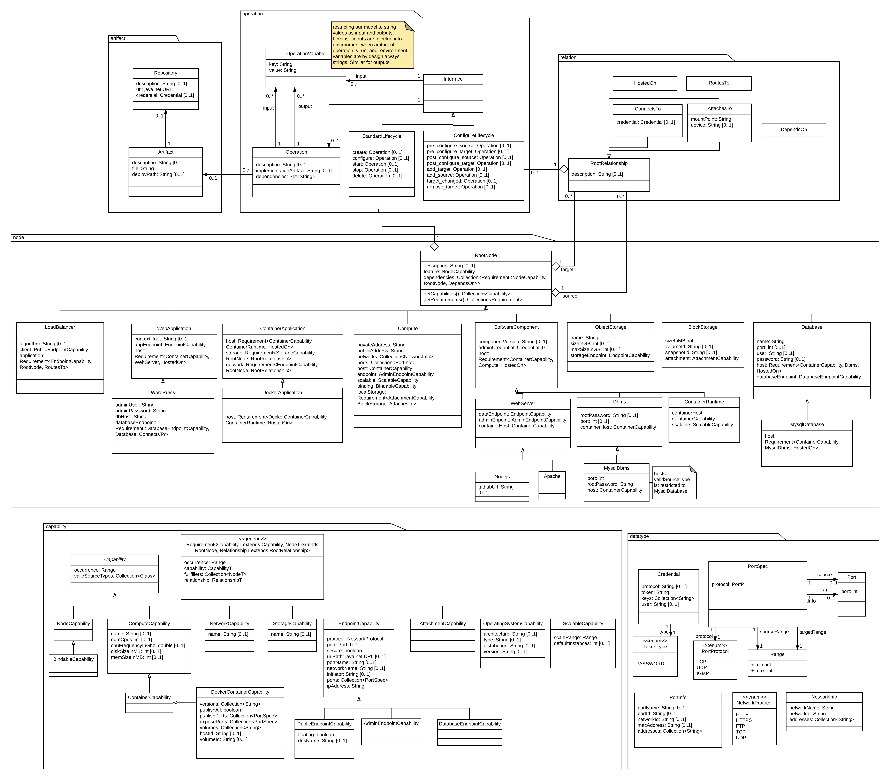

# EffectiveModel

The EffectiveModel is a component which grants a streamlined view upon a TOSCA service template within java.

The TOSCA service template language itself is optimized for convenient modelling.
Symbolic links, custom (i.e., non-semantic) type definitions and short notations aim at easing the modeller's life.
But from an orchestrator's point of view, these language mechanisms increase the complexity of the template without providing further semantics.  

The EffectiveModel component converts a modeller-friendly TOSCA template into a more orchestrator-friendly representation. Then it's ready for consumption by a plugin.  

### Obtain an EffectiveModel
Instantiation and basic interaction with an EffectiveModel is shown below.
Note that `csar` refers to a propper `Csar` instance:
```java
EffectiveModel model = EffectiveModelFactory.create(csar);
// get above mentioned higher-level graph
Graph<RootNode, RootRelationship> graph = model.getTopology();
// get set of nodes
Set<RootNode> nodes = model.getNodes():
// access inputs of service template
Map<String, InputProperty> inputs = model.getInputs();
// access outputs of service template
Map<String, OutputProperty> outputs = model.getOutputs();
```

### Iterate nodes, capabilities and relationships
All TOSCA class instances are visitable, i.e., support getting visitted by a matching visitor instance (`NodeVisitor`, `CapabilityVisitor` or `RelationshipVisitor`).
The double dispatch mechanism provided by the visitor pattern solves the problem of accessing arbitrary TOSCA types without writing a myriad of if-statements (`if node instanceof..`).   
Instead, simply extend one of the base visitor classes and implement the needed `visit` method(s).
If not implemented, the default behaviour of any `visit` method is a *noop*.  

However, sometimes it might be needed to report an error upon encountering non-implemented methods (e.g., when writing a  visitor which shall report an `UnsupportedTypeException` when visitting any node besides a `MysqlDatabase`). Therefore, the strict visitor classes `StrictNodeVisitor`, `StrictCapabilityVisitor`, `StrictRelationshipVisitor`) can be used.

##### Example: Execute action for every node of type `Apache`
```java
NodeVisitor visitor = new NodeVisitor() {
    @Override
    public void visit(Apache node) {
        doSomething(node);
    }
};
model.getNodes().forEach(node -> node.accept(visitor));
```
---
#### TODO 
### TODO METAMODEL -> INSTANCE MODEL

The model generated by the winery parser (`TServiceTemplate`) is not suitable for this task, as it describes the meta model of the topology. Using the meta model to transform a topology is rather tedious. Goal of the `EffectiveModel` is to provide a more suitable model for given purpose. When categorizing the `TServiceTemplate` as the meta model, the `EffectiveModel` is its instance model.

The model contains all normative and non-normative Types. The different Artifact Types however are not modeled. As they are neither referenced in Capability-, Relationsship- nor Node-Types I decided to give up on the distinction between artifact types (at least for now).

##### Differences to TOSCA Simple Profile
Currently not supported (& might never be):
- Networking
- Node Filter
- Node Groups
- Policies
- Workflows




