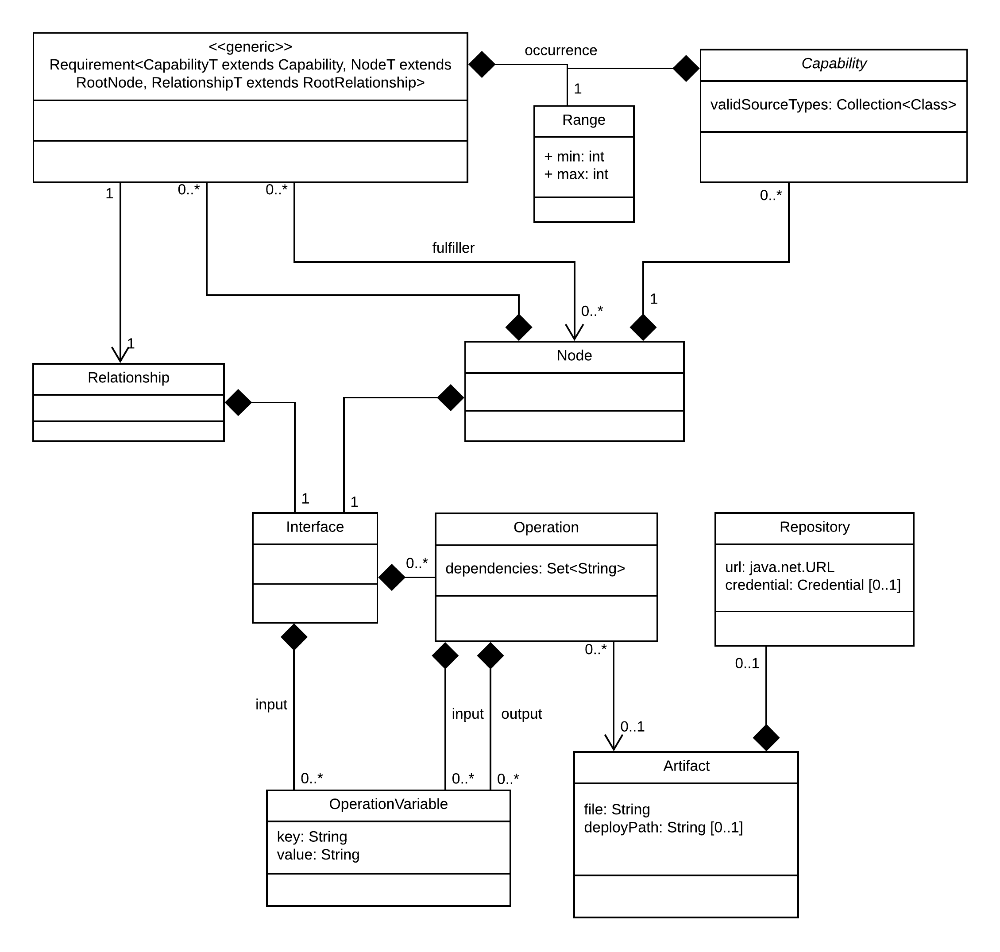

# EffectiveModel

The TOSCA service template language itself is optimized for convenient modelling.
Symbolic links, custom (i.e., non-semantic) type definitions and short notations aim at easing the modeller's life.
But from an orchestrator's point of view, these language mechanisms increase the complexity of the template, sometimes even without providing further semantics.  

The EffectiveModel component converts a modeler-friendly TOSCA template into a more **orchestrator-friendly representation**, ready for consumption by a plugin.  

Following **optimizations** aim at easing the plugin developers workload:

- **TOSCA's type system** is modelled via **java classes** - TOSCA templates are instances of the type classes
- **TOSCA's inheritance** is implemented via **java inheritance** - no need for manual lookup in supertypes
- TOSCA **symbolic names** are automatically **resolved**
- TOSCA **functions** are automatically **resolved**
- **Short** and **extended notations** are **unified** within the model
- Units of **scalar types** are **handled automatically** and served in an unambiguous way
- Data access is granted to be **type safe** - no guesswork regarding the true type necessary

The term *effective* is used in the style of the [maven](http://maven.apache.org/plugins/maven-help-plugin/effective-pom-mojo.html) project: The relation between Maven's `pom` and its `effective pom` is similar to the relation between a TOSCA service template (or the java representation [`TServiceTemplate`](https://github.com/eclipse/winery/blob/master/org.eclipse.winery.model.tosca.yaml/src/main/java/org/eclipse/winery/model/tosca/yaml/TServiceTemplate.java) from the [winery](https://projects.eclipse.org/projects/soa.winery) project) and the `EffectiveModel`.

### Obtain an EffectiveModel
Instantiation and basic interaction with an EffectiveModel are shown below.
Note that `csar` refers to a propper `Csar` instance:
```java
EffectiveModel model = EffectiveModelFactory.create(csar);
// get above mentioned higher-level graph
Graph<RootNode, RootRelationship> graph = model.getTopology();
// get set of nodes
Set<RootNode> nodes = model.getNodes():
// access inputs of service template
Map<String, InputProperty> inputs = model.getInputs();
// access outputs of service template
Map<String, OutputProperty> outputs = model.getOutputs();
```

### Iterate elements
All TOSCA class instances are visitable, i.e., support getting visited by a matching visitor instance (`NodeVisitor`, `CapabilityVisitor` or `RelationshipVisitor`).
The double dispatch mechanism provided by the visitor pattern solves the problem of accessing arbitrary TOSCA types without writing a myriad of if-statements (`if node instanceof..`).   
Instead, simply extend one of the base visitor classes and implement the needed `visit` method(s).
If not implemented, the default behaviour of any `visit` method is a *noop*.  

However, sometimes it might be needed to report an error upon encountering non-implemented methods (e.g., when writing a  visitor which shall report an `UnsupportedTypeException` when visiting any node besides a `MysqlDatabase`). Therefore, the strict visitor classes `StrictNodeVisitor`, `StrictCapabilityVisitor`, `StrictRelationshipVisitor`) can be used.

##### Example: Execute action for every node of type `Apache`
```java
NodeVisitor visitor = new NodeVisitor() {
    @Override
    public void visit(Apache node) {
        doSomething(node);
    }
};
model.getNodes().forEach(node -> node.accept(visitor));
```
---
## Design 

##### General structure


For the sake of clarity, the subclasses of the classes `Node`, `Capability`, `Relationship` and `Interface` are not shown in above diagram.

However, these subclasses represent the TOSCA type definition.
Read more about [TOSCA type support](type-support.md).
