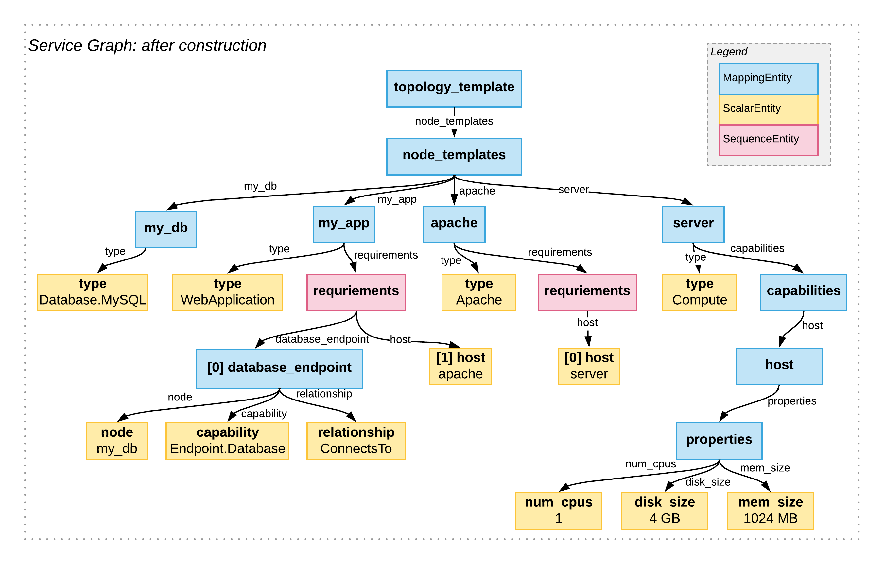

# ServiceGraph

The ServiceGraph is the backbone of the EffectiveModel.

Basically, it's a graph strucuture (based on [JGraphT](jgrapht.org/)) which reflects the content of a TOSCA service template.

### Building blocks
There are three different types of nodes in the ServiceGraph:

A `MappingEntity` can have **multiple children**.  
A `SequenceEntity` behaves like a `MappingEntity`, but their **children are ordered**.  
A `ScalarEntity` can have an **associated value**, but never has children.  

Nodes, no matter what type, also have a name.  

The edges of the graph are directed. 
Additionally, each edge has a name which equals the name of its target node. 
This allows for traversing symbolic links (as shown later).

*This categorization is strongly linked to the general nature of YAML*. 

## An example
In the following, we'll show how a `ServiceGraph` is being construction. Therefore, we use below TOSCA service template for demonstration. Thereafter, we'll look into each consecutive graph transformation step.

##### TOSCA service template
```yml
topology_template:
  node_templates:
    my_db:
      type: Database.MySQL
    my_app:
      type: WebApplication
      requirements:
        - database_endpoint:
            node: my_db
            capability: Endpoint.Database
            relationship: ConnectsTo
        - host: apache
    apache:
      type: Apache
      requirements:
        - host: server
    server:
      type: Compute
      capabilities:
        host:
          properties:
            num_cpus: 1
            disk_size: 4 GB
            mem_size: 1024 MB
```
>*Disclaimer: This example is by no means a complete template, nor necessarily compliant with the TOSCA Simple Profile.*

### Step 1: Construction
After [SnakeYAML](https://bitbucket.org/asomov/snakeyaml) parsed the template, a rather simple algorithm uses the outcome to construct following ServiceGraph:



The resulting graph structure closely recreates the original YAML structure.

### Step 2: Normalization
Sometimes, TOSCA allows an abbreviated syntax instead of it's more verbose extended notation.
In order to ease further handling of the graph, every short notation is being converted to its extended equivalent. We call this process **normalization**.
After normalizing the graph, its structure looks like this:


The short notation of the `host` requirements of the `my_app` and `apache` nodes have been converted to their extended notation.

### Step 3: Symbolic Link Resolving
In the last step, TOSCA's symbolic links get resolved. This is accomplished by introducing new edges which point to the referenced node and removing the now obsolete symbolic link. 


The new edges are marked in red. 
They replace the former ScalarEntities which contained symbolic names.  
Pay attention to how each edge kept the name of the replaced node; 
this way, propper graph traversion remains possible.

>*Note: Together, step 2 and 3 are called 'finalization of the graph'.*

