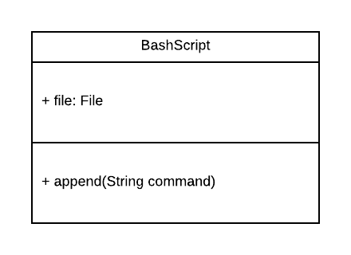
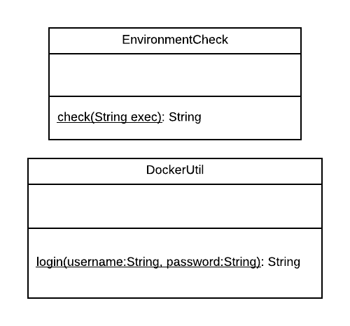

# Bash script generator

To provide the user a easy to use target artifact we provide him several build and deploy scripts. Since every plugin has to create those scripts is is better to build a generator that simplifies this job and ensures that the plugins do not produce duplicated code.

## Idea



Provide a `BashScript`-class which initializes a `.sh` file with a Shebang (`#!/bin/sh`) and a line that sources all component scripts. To add lines to the the bash script just use the append method.



To ease the process of adding needed functions to the bash script there are several static util component classes. The `EnvironmentCheck` and `DockerUtil` in the diagram aboth are two examples. Each of them has a underlying bash script that contains functions that are sourced in a script created by the `BashScript` class.

## Example

**EnvironmentCheck script in the components folder:**

```bash
#!/bin/sh

function check () {
  echo "Check if $1 is available."                                                      
  if ! [ -x "$(command -v $1)" ]; then                                                 
    echo "Error: $1 is not installed." >&2                                             
    exit 1                                                                                 
  fi   
}
```

**EnvironmentCheck::check(String executable):**

```Java
public String check (String executable) {
    return "check " + string;
}
```

**Code that generates a script:**

```java
public void createScript(Path path) {
    BuildScript script = new BuildScript(path);
    buildScript.append(EnvironmentCheck.check("docker"));
}

```

**Result:**

```Bash
#!/bin/sh

source components/*

check "docker"
```

The util scripts are saved in the target artifact in the `output/scripts/util`-folder the scripts genereated with the `BuildScript`-class should be saved in `output/scripts/`.
