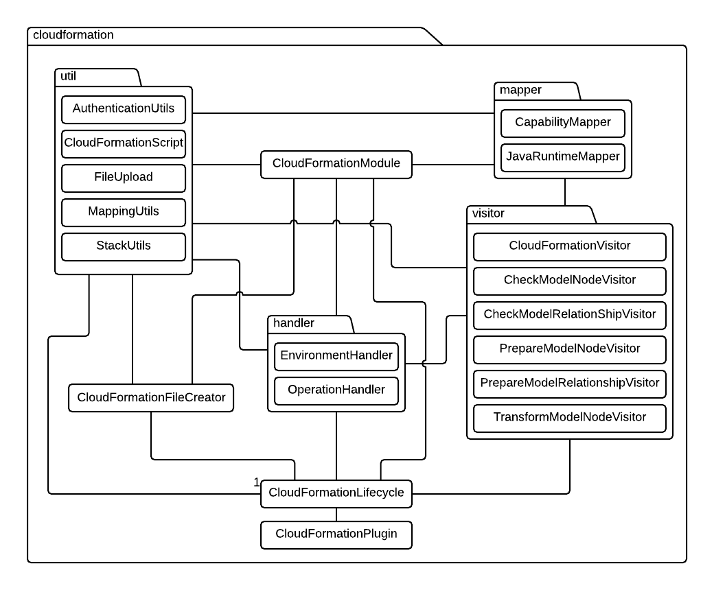

# Architecture

In this section, we'll discuss the basic architecture of the CloudFormation plugin as well as the basic roles of the various classes that constitute it.
The following is simplified UML diagram of the `cloudformation` package:

## Cloudformation package

The `cloudformation` package is the basic package of the CloudFormation plugin. It contains the `CloudFormationPlugin`, `CloudFormationLifecycle`, `CloudFormationModule` and `CloudFormationFileCreator` classes.

### `CloudFormationPlugin`

`CloudFormationPlugin` is an extension of the `ToscanaPlugin` class representing the CloudFormation platform. The following are the platform properties of the CloudFormation plugin:

- The `AWS Region` which determines where the transformed model will run in
- The `AWS Access Key ID` and the `AWS Secret Key` which are the credentials used to communicate with AWS during the transform phase of the transformation lifecycle
- The `AWS Keypair` which, if set to true, makes sure that the EC2 instances can be accessed via SSH with a valid [AWS EC2 Keypair](https://docs.aws.amazon.com/AWSEC2/latest/UserGuide/ec2-key-pairs.html).
> **Note**: If the `AWS KeyPair` property is set to **true**, the name of your AWS EC2 Keypair must be manually replaced in the `create-stack.sh` script of the [target artifact](deployment/target-artifact.md#scripts) before deployment.

### `CloudFormationLifecycle`

`CloudFormationLifecycle` is an extension of the `AbstractLifecycle` class which contains the lifecycle phases that are executed if the user initiates the transformation procedure.
For further information about the behaviour of the CloudFormation plugin during each of these phases, please refer to the [transformation workflow](transformation/transformation-workflow.md).

### `CloudFormationModule`

`CloudFormationModule` is an extension of the [`Module`](https://github.com/StuPro-TOSCAna/cloudformation-builder/blob/master/src/main/java/com/scaleset/cfbuilder/core/Module.java) class of the cloudformation-builder. Originally, it was used in order to represent the Java model of a CloudFormation template, but in order to fulfil the needs of our plugin, we extended it with additional fields and methods needed to facilitate the deployment of our template. During the transformation, it gets filled with the information in order to create the CloudFormation template and any additional files needed for deployment.

## Visitor package

The `visitor` is used to iterate over the EffectiveModel during the TransformationLifecycle.

### `CloudFormationVisitor`

`CloudFormationVisitor` is the abstract class superclass for all visitor classes. It contains the `Logger` to log messages while visiting and all visitors iterates over the `Topology` of the `EffectiveModel`. There are also various utility methods to be used by the visitors during the transformation lifecycle.

The behaviour of the specific child classes of the `CloudformationVisitor` are explained in detail in the [transformation workflow](transformation/transformation-workflow.md).

## Handler package

The `handler` package is used to handle the transformation of TOSCA operations. It contains the `EnvironmentHandler` and `OperationHandler` classes. The behaviour of these handler classes is explained in the [Transformation by TOSCA type](transformation/supported-types.md#generic-transformation-of-nodes-hosted-on-compute) chapter.

## Mapper package

The `mapper` package is used to map TOSCA CapabilityTypes and the JavaRuntime NodeType. It contains the `CapabilityMapper` and `JavaRuntimeMapper` classes. The behaviour of these mapper classes is explained in the [Capability Mapping](transformation/supported-types.md#2-capability-mapping) and [JavaApplication](transformation/supported-types.md#javaapplication) of the Transformation by TOSCA type chapter.
