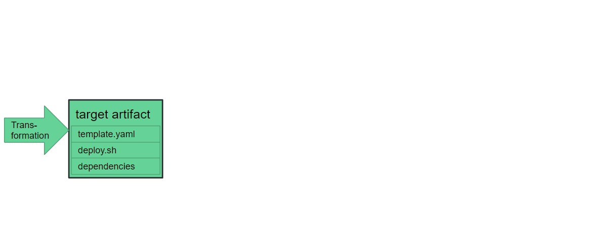
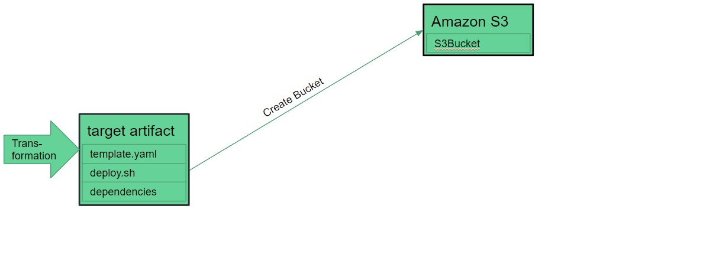
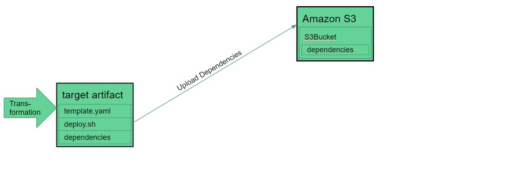
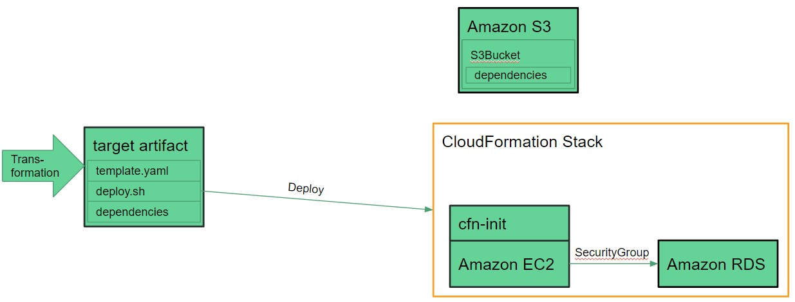
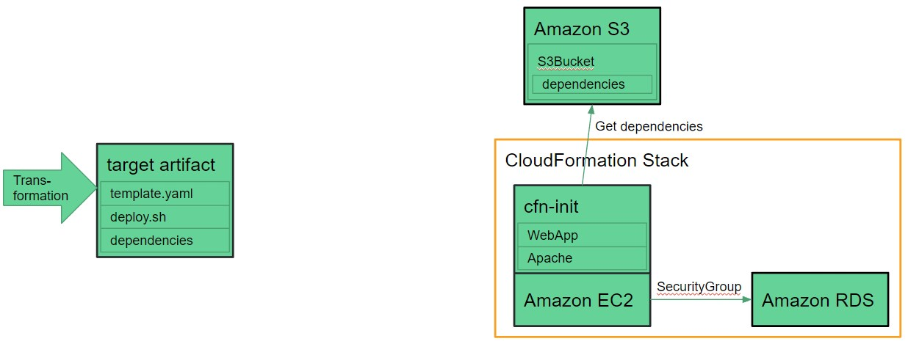
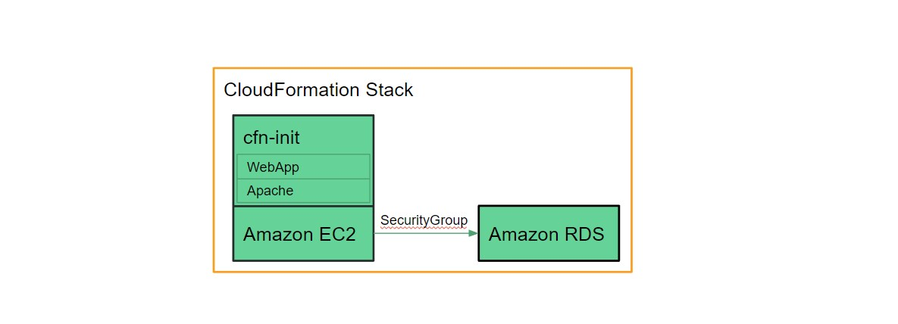

# Deployment Workflow

As explained in the transformation workflow chapter, the target artifact generated by the transformation is not a single CloudFormation template, but rather a template, additional files and scripts all needed for the deployment.

Therefore, additional steps are required besides just simply deploying the template to CloudFormation. This chapter explains these steps as the intended workflow of the deployment.

    TODO: Add link to transformation workflow chapter

## Deployment Step-by-Step

Before the deployment begins, we start with the target artifact generated by the transformation with the CloudFormation plugin.

>**Note**: The images used in this document are taken from the deployment of the LAMP example explained in transformation examples. Other transformations may differ in specifics but the general deployment behaviour is the same.

    TODO: Add link to transformation examples.

The deployment can be divided into several steps. These steps are done through the use of bash scripts. For further information about these scripts, please refer to the target artifact chapter. The execution of these steps follow the order specified below.

    TODO: Add link to the target artifact chapter.

### 1. Create an S3 Bucket

The first step in the deployment is the creation of an S3 bucket in order to store any additional files needed for the deployment of the template.

### 2. Upload Files

Once the S3 bucket is created, the necessary files can be uploaded to Amazon S3. During the transformation, specific resources were added to the CloudFormation template in order to allow authenticated access to these files from the EC2 instances that need them.

### 3. Deploy Template

At this point, all necessary requirements in order to deploy the CloudFormation template have been met. The creation of the CloudFormation stack is initiated by deploying the CloudFormation template.

### 4. Create the CloudFormation Stack

Finally, the CloudFormation stack containing the Amazon resources specified by the CloudFormation template is created. The following actions take place on the AWS platform and are not influenced by the deployment scripts.

As a part of the deployment, the EC2 instances are bootstrapped with CloudFormation-Init (See chapter transformation by nodetype for more information). The files needed for bootstrapping the instances are supplied by the previously created S3 bucket. 

    TODO: Add link to nodetype chapter.

Once all resources have been created and CloudFormation-Init has finished, the deployment is complete.

