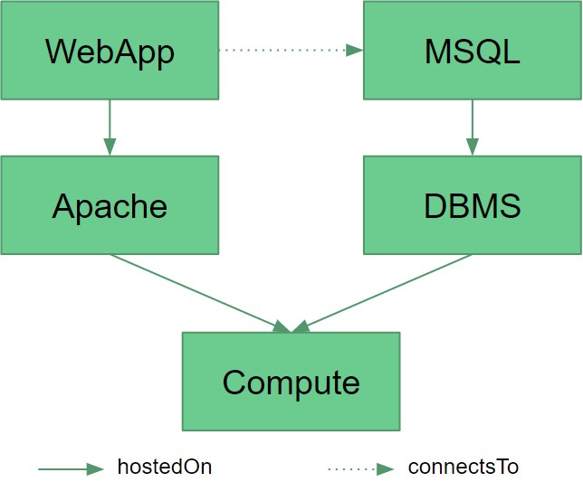
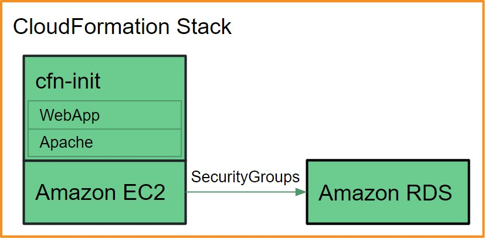

# Transformation by Example

In this chapter, the transformation mapping of the CloudFormation plugin is further explained by walking through the transformation of a complete TOSCA model.

## TOSCA LAMP model

The example used is a simple LAMP stack consisting of a PHP WebApplication connected to a MysqlDatabase which are hosted on an Apache webserver and a MysqlDBMS respectively, which in turn are both hosted on one Compute node. The following is a graphical representation of the TOSCA model:

## Transformation Process

First, the underlying Compute node is mapped to an [**EC2 instance**](https://docs.aws.amazon.com/AWSCloudFormation/latest/UserGuide/aws-properties-ec2-instance.html).

Then the WebApplication and Apache nodes are transformed. These do not get their own AWS resources but are instead added to the EC2 instance via [**CloudFormation Init**](https://docs.aws.amazon.com/AWSCloudFormation/latest/UserGuide/aws-resource-init.html) and the [**cfn-init**](https://docs.aws.amazon.com/AWSCloudFormation/latest/UserGuide/cfn-init.html) script. During the transformation process, all the necessary files needed to setup these nodes (e.g. implementation artifacts, dependencies etc.) are added to the CloudFormation Init as files and commands.

The Mysql node is removed from the Compute node and gets its own [**RDS DBInstance**](https://docs.aws.amazon.com/AWSCloudFormation/latest/UserGuide/aws-properties-rds-database-instance.html).

The connection between the EC2 instance and the RDS DBInstance is made possible through SecurityGroups which open the necessary ports.

## CloudFormation Stack

When deploying the completed CloudFormation template on AWS, the EC2 instance automatically runs the `cfn-init` script in order to bootstrap the instance. It downloads the necessary files from an S3 bucket as explained in the [Deployment Workflow](../deployment/deployment-workflow) chapter and runs the lifecycle scripts.

The following is a simplified graphical representation of the resulting CloudFormation stack:

