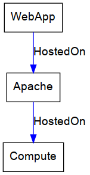
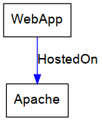
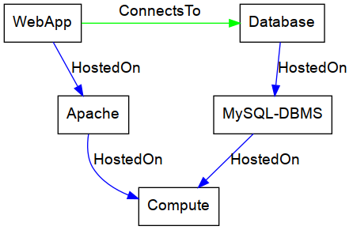

# Definitions

To simplify the documentation of the Kubernetes plugin, the following terminologies are used.

## Complete Topology

For simplicity we assume that the topology is described completely with no implicit node template definitions.
The most important part of this is, that every `host` requirement is fulfilled.
I.e., every node (excluding storage nodes) has a direct or indirect (transitive) `HostedOn` relationship to a compute node.
Missing artifacts (for example when using non normative types) does not represent a issue by default.

| Complete topology                | Incomplete topology               |
| :------------------------------- | :-------------------------------- |
|    |   |

## Top-level node

A top-level node is a TOSCA node that does not have any nodes hosted on it (i.e. the node does not have any `HostedOn` child nodes).
It therefore represents the highest level node in the topology, hence the name top-level node.

## Node stack

A node stack represents one application (top-level node) within the topology.
The top-level node (application node) and all its `HostedOn` parents down to the compute node is called a node stack.
It is possible to have multiple node stacks with the same parent nodes (including the compute node).

The following example shows the grouping of node stacks using a single compute node LAMP style application.

The node stacks in this topology are:

| Node Stack 1 (WebApp) | Node Stack 2 (Database) |
| :-------------------- | :---------------------- |
| WebApp                | Database                |
| Apache                | MySQL-DBMS              |
| Compute               | Compute                 |
