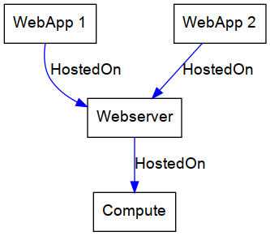
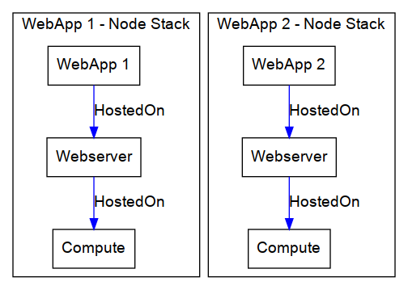
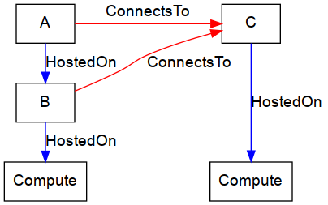
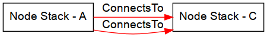

## Limitations of the node stack building algorithm

### Multiple application host

To illustrate this limitation the following sample topology will be used:

Applying the NodeStack building algorithm will result in the following two node stacks:

If we assume that the port of the WebApplications are determined by the parent web server (for example: Apache or Tomcat)
this configuration will result in a port conflict, because the web servers in each node stack
feature the same configuration (i.e. the same port) and the same compute node, meaning they will land in the same pod.
A pod wont work properly if two containers want the same port, therefore such a topology cannot be transformed properly.

if the WebApplications determine the port, the given topology can be transformed if the ports are different. This could be the case when messing with NodeJS applications.

A similar issue can also be applied to databases.

## Limitations of the connection graph

### Multiple outgoing connections to the same node stack

The connection graph currently only considers of one connection per direction in between two node stacks.
To illustrate this limitation we will take a look at the following topology.
(We use intermediate types, because we currently do not support types that might cause this issue):

The resulting connection graph would look like this:

However, due to the current implementation of the ConnectionGraph, we are only able to store one of the edges.
