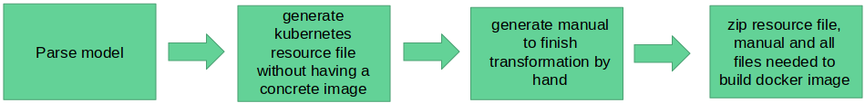

# Simple kubernetes plugin

**Disclaimer:** the plugin presumes that we have a simple csar file with one docker-node

**Problem:** Kubernetes needs the docker image to be stored in a registry, there are many different registries, private and public which makes this quite komplex.

**Solution:** Generate a kubernetes config-file without building the docker image.

**Steps to achieve this solution:**
1. Read the csar
2. Fill the given yaml-templates with the given information:
  - fill the labels and app name according to the docker image name
  - don't fill the image name, but add a comment for the user
3. Generate a bash build script to build all existing docker images.
4. Generate archive containing the config file and a folder with the *Dockerfile*
  and everything that is needed to build the docker image. Additionaly there is a *Readme.md*
  that explains how to finish the transformation manually.

    A transformation artefact could look like:
    ```
    transformed_artefact.zip
    |--- Readme.md
    |--- kubernetes-config.yaml
    |--- build_docker_images.sh
    |--- app
        |--- Dockerfile
        |--- index.php
        |--- ...
    ```

Simple diagram of the simple kubernetes plugin steps:


