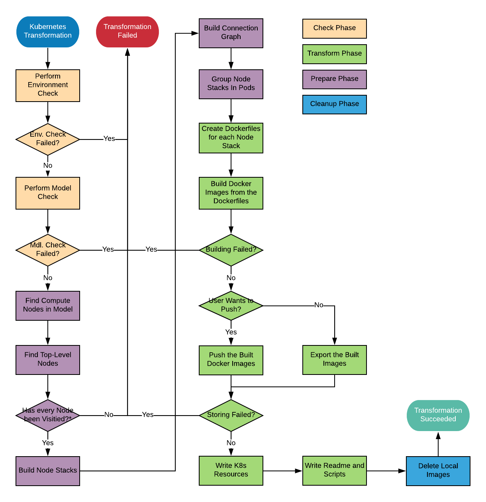
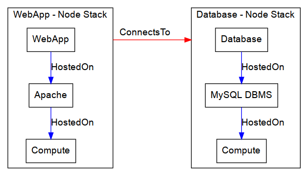

## Flow chart of the transformation procedure



*Note*: The check if every node gets visited only includes nodes relevant for the transformation,
Nodes that do not get considered by the Kubernetes plugin (e.g. BlockStorage if supported)
do not have to be visited to determine the Node Stacks and are therefore not considered here.

## Check Phase

During the check phase a quick analysis is performed
to find out if the given topology can be transformed using the Kubernetes plugin.

### Environment check

During the environment check the `KubernetesLifecycle` will find out if the system that runs the
TOSCAna transformer is able to transform using the Kubernetes plugin.
This is possible if the requirements for transforming (described under [Requirements](../../../user/plugins/kubernetes/requirements.md)) are fulfilled.
If this is not the case, the transformation will fail.

***A small note for pushing to a Registry:***
Currently this check does not include a check for the registry credentials.
This means we currently do not validate the supplied registry credentials and the transformation will
fail during the storing process if the credentials are not correct!

### Model check

During the model check we use a strict visitor (this type of visitor throws a exception if the method is not implemented) to find out if a node type is supported or not.
We just run the accept command for every node and return `false` if one of them throws a exception.
The check passes if no exception gets thrown.

## Prepare phase
In general the `prepare` phase analyzes the given model and groups the nodes for further processing,
this is done in the following four sub phases:

  1. Determining top-level nodes
  2. Building node stacks
  3. Building the connection graph
  4. Determining pods

These sub phases get executed sequentially,
that means the results computed in the previous phase are required by the following ones.

### Determining top-level nodes

To find all top-level nodes in a topology we first of all look for compute nodes within the topology.
This is done using a visitor (`ComputeNodeFindingVisitor`) this visitor puts all compute nodes into a list.
This list can then be used to determine the top-level nodes.

This approach works, because we assume that the topology given is complete.
This means that every node (except for storage) has a direct or indirect HostedOn relationship to a compute node.

After finding all compute nodes we use a level-order type iterator to take a look at all child nodes (with a HostedOn relationship).
If we encounter a node that does not have a child node, we consider the node a top-level node.
These nodes are stored in a set and will be used in the next step to determine the node stacks in the topology.

### Building node stacks

Once the top-level nodes have been determined, we can build the node stacks.
To perform this operation we iterate from the top-level node back down to its (direct or indirect) compute node parent.
On the way we store every node in between as well as the compute node and the top level node itself in a list. (Keeping the correct order)

### Building the connection graph

To simplify the handling of connections we build a graph with the node stack objects (`NodeStack` in java)

This is done by Contracting the HostedOn Edges within a Node Stack. The Remaining edges (with a ConnectsTo relationship)
get stored in a seperate graph (the so called ConnectionGraph) with the corresponding Node Stacks as the vertices.
Due to the current Implementation we do not support multiple connections with the same direction between Node Stacks (See [Limitations](limitations.md) for more info)

The following Image shows the connection graph for the multi node LAMP example csar:



### Determining pods

In order to set the private and public addresses of nodes, we have to know the Kubernetes services and the corresponding pods.
The grouping in pods is done by finding all node stacks with the same compute node.

All node stacks with the same compute node belong into the same pod.
They will therefore also have the same Kubernetes service, if the pod exposes any ports.
A services is only generated if the pod exposes anything.

During this step we also set the public and private addresses of the compute nodes to `<podname>-service`,
where the pod name is the same name as the name of the top-level node in the first node stack.
It is possible to rework this naming mechanism to produce a more informative result.

## Transform Phase

Just like the `prepare` phase this phase consists of multiple sub processes.
This phase will take the preprocessed model and transform it.
The Transform phase consists of the following sub phases:

  1. Building Dockerfiles
  2. Building Docker images out of the Dockerfiles
  3. Storing the Docker images
     - **Option 1**: Pushing to a registry
     - **Option 2**: Exporting to `.tar.gz` archives
  4. Creating the Kubernetes resources
  5. Wrting scripts and readme

### Building Dockerfiles

The building of Dockerfiles is done using the `DockerfileMappingVisitor`,
this visitor takes the Node stack and converts it into a Dockerfile.
For more information please read [Building Dockerfiles](building-dockerfiles.md).

### Building Docker images

Once the Dockerfiles have been built, a `ImageBuilder` for each created Dockerfile will be instantiated.
These image builders will build the image with the name of the node stack (The name of its top level node) as the default tag.
If one of the building processes fails, the transformation will fail.
This process is equivalent to executing `docker build . -t <Node Stack name>` in the working directory of the Dockerfile.

### Storing the Docker images

A Docker image registry (like DockerHub) is needed to access the images from within the Kubernetes cluster.
With the Kubernetes plugin the user can either decide to push the images from within the transformation
(The user has to supply credentials before the launch of the transformation)
or he can push the images later using a simple shell script,
The shell script and the Exported images are shipped in the transformation artifact.

#### Pushing to a registry

When pushing has been selected, we assume that the user has supplied correct registry credentials.
These credentials consist of:

| Value           | Description                                                     |
| :-------------- | :-------------------------------------------------------------- |
| Registry URL    | The URL to access the registry (Defaults to DockerHub if empty) |
| Username        | The username to Login to the registry                           |
| Password        | The password to Login to the registry                           |
| Repository Name | The name of the repository to push into                         |

The images will usually be pushed in the same order as they have been built.

**NOTE**: We assume the following naming scheme for image tags:
```
(<URL>/)<USERNAME>/<REPOSITORY>:<TAG>
```

#### Exporting to `.tar.gz` files

The Export feature creates `.tar.gz` archives for every image, these images are stored in the target artifacts `output/docker` directory.
Just like the Dockerfiles.
The name (excluding the file ending) and the tag of the archive is equal to the name of the corresponding node stack.

### Creating Kubernetes resources

Once the Images have been stored, we will create the Kubernetes resources.
That means: services and deployments. A deployment is created for each pod in the topology,
the name of the deployment is equal to the pod name with the suffix `-deployment`.
Every deployment gets a unique Label (the label is considered unique within the topology)
that can be associated with exactly one service, such a corresponding service is only generated
if the currently investigated pod will expose any ports.

The current mechanism puts all resulting Kubernetes resources into one file named `complete.yml`
that can be located in the `output/kubernetes-resources` sub folder within the artifact.

### Writing scripts and readme

Once the resources have been written, we will write a readme file (in simple HTML format).
After the readme a deploy script (`deploy.sh`) gets written,
as well as the image pushing script if the images were just stored instead of being directly pushed to a registry.

## Cleanup phase

The Cleanup phase just removes all localy created Docker images, just the ones that have been created, the parent images that have been pulled from some Registry.
