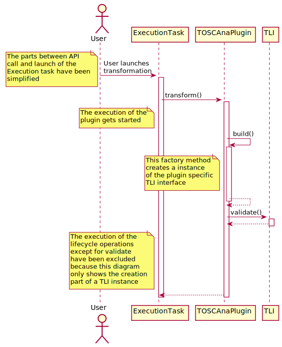
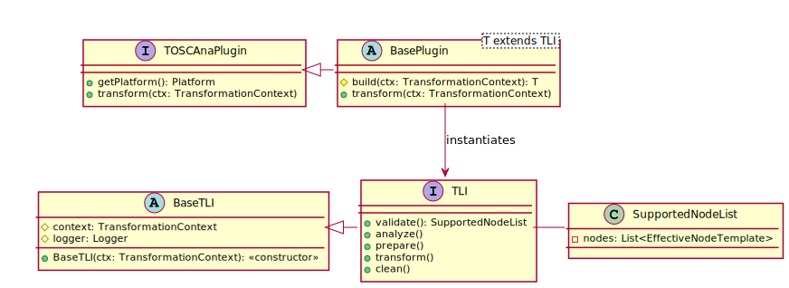

# Transformation Lifecycle Archtecture

## Introduction

**IMPORTANT**: Currently the diagrams are created using PlantUML once this has been finalized I will convert this to a proper LucidCharts diagram. PlantUML just seems to be the most suitable solution to quickly get a decently looking class diagram. (especially when working on this with a smartphone)

This document and the corresponding diagrams represent a potential architecture for the lifecycle operations of a transformation described in Pull Request #159. It was expected, that a transformation has to support the operations:

- `validate()`
- `analyze()`
- `prepare()`
- `transform()`
- `clean()`

The tasks these operations should realize get described in the document Submitted in PR #159

The lifecyle approach is resolving several general issues:

- Splitting the transformation into tasks (lifecycle operations) allows a very simple progress calculation. (More information will follow below)
- Simplifies the plugin implementation in terms of code size because common parts can get externalized (removes boilerplate code)

## Possible implementation approaches

While thinking about a good approach to implement this the following two approaches seem to be the most interesting. I will try to list some pros and cons of both approaches to allow a discussion about what option we chose.

### Approach #1 Using predefined methods

In this approach the TransformationLifecycleInterface (short: TLI) has methods that represent each task these methods get called in the sequence that was defined in PR #159.

The creation is done using a factory method that has to be implemented by all subclasses of the `BasePlugin` (currently called `AbstractPlugin`) to produce a Plugin Specific instance of the TLI interface.

The creation process (in a simplified version) has been modeled in the following sequence diagram. The execution of the lifecycle tasks is not shown here.

**Class Diagram**

