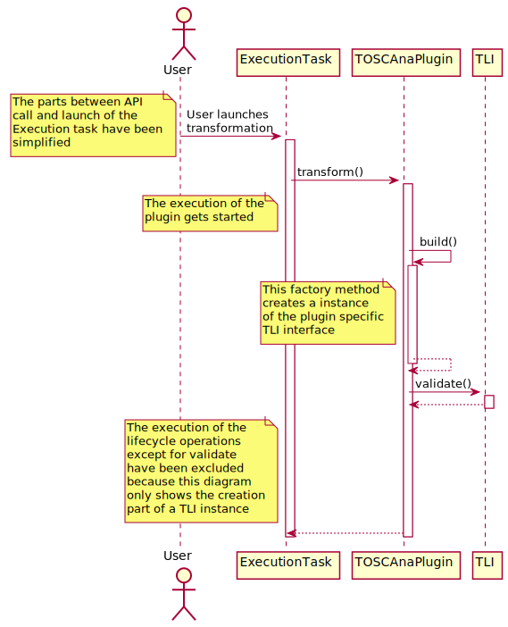
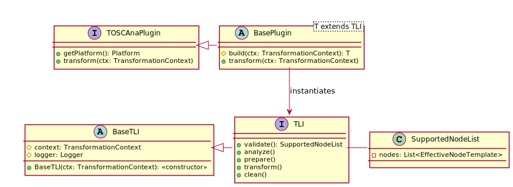

# Transformation Lifecycle Archtecture

**IMPORTANT**: Currently the diagrams are created using PlantUML once this has been finalized I will convert this to a proper LucidCharts diagram. PlantUML just seems to be the most suitable solution to quickly get a decently looking class diagram. (especially when working on this with a smartphone)

## Introduction

This document and the corresponding diagrams represent a potential architecture for the lifecycle operations of a transformation described in Pull Request #159. It was expected, that a transformation has to support the following operations (descriptions have been taken from [here](transformation-lifecycle.md)):

1. `validate()` - in this phase the plugin provides a list of supported TOSCA types, then the graph that is enqued for transformation will be checked if it contains types the plugin can not handle. If the result is positive the transformation continues else it will abort.
2. `analyze()` - in this phase the plugin analyzes the graph to find out how to handle it.
3. `prepare()` - in this step the plugin processes the graph to transform it in the following step. For example the kubernetes plugin needs to split the graph into container and pods.
4. `transform()` - this is where the real transformation is happening.
5. `clean()` - in this phase the plugin cleans up remaining leftovers from the previos steps. This can be for example files generated during the transformation that are not part of the target artifact.

The lifecyle approach is resolving several general issues:

- Splitting the transformation into tasks (lifecycle operations) allows a very simple progress calculation. (More information will follow below)
- Simplifies the plugin implementation in terms of code size because common parts can get externalized (removes boilerplate code)
- The plugins structure gets way clearer.

The TransformationLifecycleInterface (short: TLI) has methods that represent each task these methods get called in the sequence that was defined in PR #159 (or above).

The creation is done using a factory method that has to be implemented by all subclasses of the `BasePlugin` (currently called `AbstractPlugin`) to produce a Plugin Specific instance of the TLI interface.

The creation process (in a simplified version) has been modeled in the following sequence diagram. The execution of the lifecycle tasks is not shown here. They will be executed in the order described above if the validation (`validate()`) is sucessful,

**Class Diagram** The class diagram show here is a simple representation that only partially contains return types and parameters

Currently no parameters and return values get defined except for the `SupportedNodesList` this is just a wrapper. It is only used to illustrate

## Progress caluclation

Putting tasks in seperate methods allows a very simple, but also very inacurate way to calculate the progress. (at least when looking at execution time):

- Once a step gets completetd, the progress gets incremented by `(<Current Step Number> / <Total Step count>) * 100` per cent.
    - This option is very simple, but inacurate when looking at time based measurements. For example: If we decide to build Docker images while Transforming. This step will take way longer than just validating the Csar.

