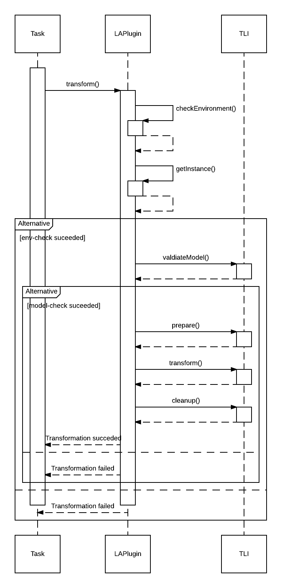

# Transformation Lifecycle Architecture

## Introduction

This document and the corresponding diagrams represent a potential architecture for the lifecycle operations of a transformation described in Pull Request [#159](https://github.com/StuPro-TOSCAna/TOSCAna/pull/159). It was expected, that a transformation has to support the following operations (descriptions have been taken from [here](transformation-lifecycle.md)):

1. `validate()` - The validation phase performs several checks to ensure that the transformation can even be executed (for details see [Validation Phase](#validation-phase))
3. `prepare()` - in this step the plugin processes the graph to transform it in the following step. For example the kubernetes plugin needs to split the graph into container and pods.
4. `transform()` - this is where the real transformation is happening.
5. `clean()` - in this phase the plugin cleans up remaining leftovers from the previos steps. This can be for example files generated during the transformation that are not part of the target artifact.

The lifecyle approach is resolving several general issues:

- Splitting the transformation into tasks (lifecycle operations) allows a very simple progress calculation. (More information will follow below)
- Simplifies the plugin implementation in terms of code size because common parts can get externalized (removes boilerplate code)
- The plugins structure gets way clearer.

The TransformationLifecycleInterface (short: TLI) has methods that represent each task these methods get called in the sequence that was defined in PR Pull Request [#159](https://github.com/StuPro-TOSCAna/TOSCAna/pull/159) (or above).

The creation is done using a factory method that has to be implemented by all subclasses of the `BasePlugin` (currently called `AbstractPlugin`) to produce a Plugin Specific instance of the TLI interface.

## Validation Phase

The validation phase can be split into two different validation phases:
- `environment check` - in this phase the plugin should check if it has everything available to perform the transformation. This means that all required CLI applications have been installed and are accessible. For example: The kubernetes plugin needs a connection to a running docker daemon to perform the transformation (when following the point that docker images get built automatically)
- `model check` (property check) - this phase checks the model for invalid properties. For example the kubernetes plugin will reject the transformation if a node is based on windows.

### Execution order

The execution of these phases should look like this:

`env-check -> model-check`

This order is chosen because the first task is probably the "simplest" one to execute and the last one (model check) is the most complex because we have to iterate over the whole graph to look for those problems.

### Implementation approach

TOSCAna Plugin (just for illustration purposes, class diagrams will follow):
```java
public abstract class LifecycleAwarePlugin<T extends TransformationLifecycle>
    implements TransformationPlugin {
    protected abstract Set<Class<? extends RootNode>> getSupportedNodeTypes();
    protected abstract boolean checkEnvironment();
    protected abstract T getInstance(TransformationContext ctx);

    public void transform(TransformationContext ctx) {
        //This method will implement the mechanism to execute the seperate phases
    }

}
```
**Method descriptions**
- `checkEnvironment()` - Performs ths `env-check` part of the validation phase
- `getInstance()` - Factory method, to produce a instance of the plugin specific Lifecycle interface with the given transformation Context

```java
public interface TransformationLifecycle {
    boolean validateModel();
    void prepare();
    void transform();
    void cleanup();
}
```
**Method descriptions**
- `validateModel()` - This method should be used to check the model (probably by iterating over it). If a property is not supported (i.e. Windows on Kubernetes) the check should return false.
- `prepare()`, `transform()` and `cleanup()` - Perform the corresponding phase described in the [Introduction](#introduction)  

##### Sequence diagram

The order in which these methods get called is shown in the following sequence diagram:



## Progress calculation

Putting tasks in separate methods allows a very simple, but also very inaccurate way to calculate the progress. (at least when looking at execution time):

- Once a step gets completed, the progress gets incremented by `(<Current Step Number> / <Total Step count>) * 100` per cent.
    - This option is very simple, but inaccurate when looking at time based measurements. For example: If we decide to build Docker images while Transforming. This step will take way longer than just validating the Csar.
    
Note: Progress calculation got removed in February '18
