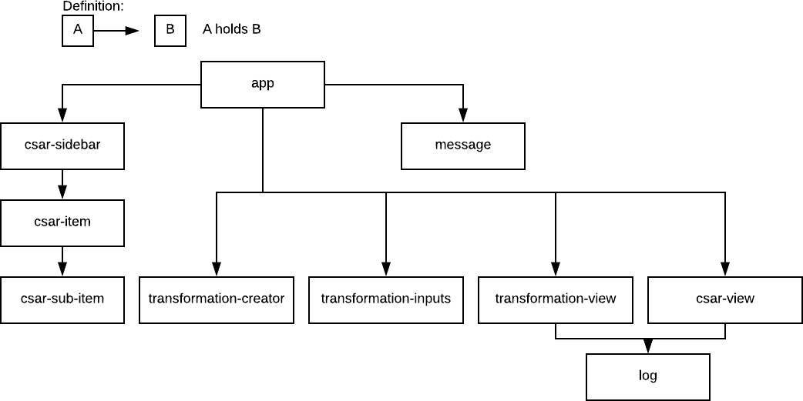
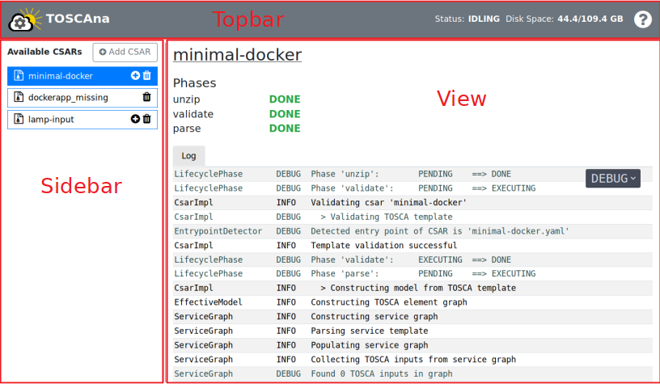
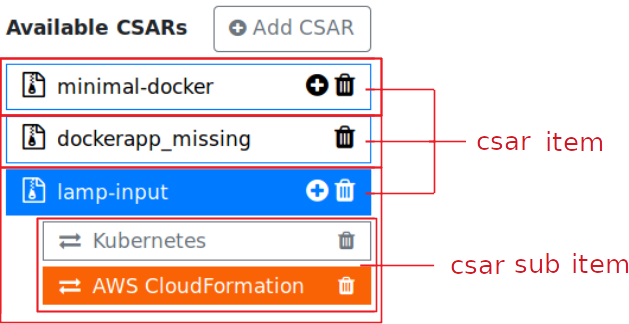
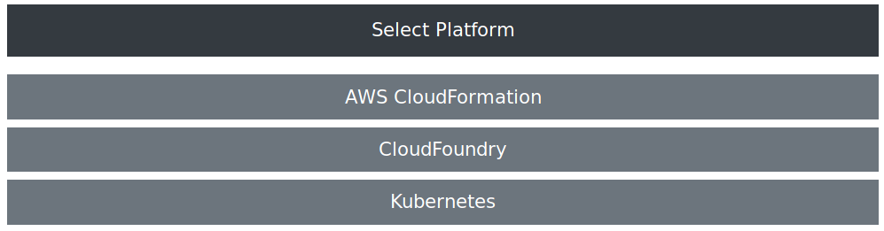
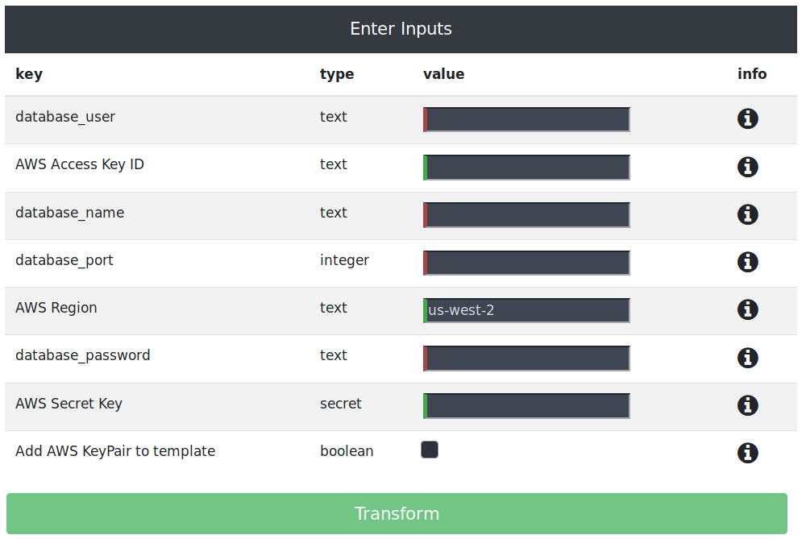
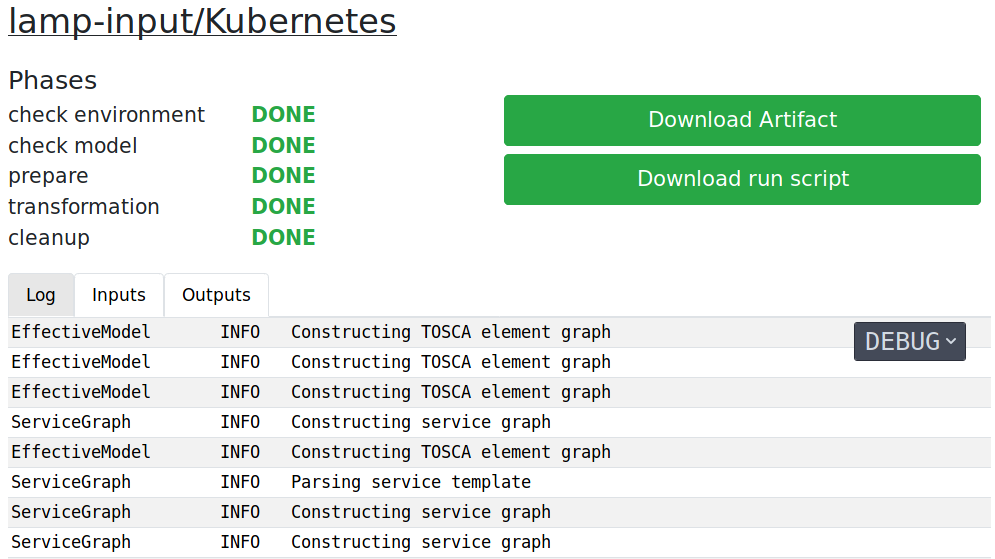
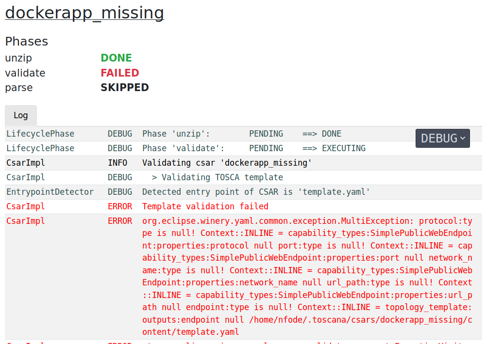
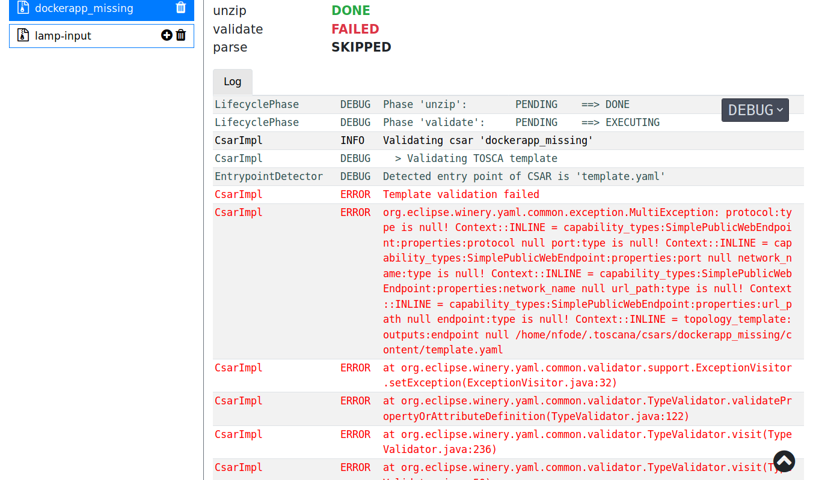
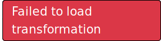

# Components
**Note:** This guide assumes you are in the `app/src/app/` folder.

In Angular components are used to seperate an application in different display blocks that display data, listen on user input, and take action based on that input.

In the following all components of the TOSCAna web app will be shortly explained:

## Overview

## app

The app component is the entry point of the web app it holds the topbar, sidebar and the view.

**View:** The content of the view changes dynamically based on the route. The `routes` array in `modules/routing/routing.modules.ts` maps a route to a component.
You can read more about routing [here](https://angular.io/guide/router) in the Angular docs.

## csar-sidebar 

The sidebar shows all available CSARs if you click on a CSAR it also shows its sub items.

The sidebar component also manages CSAR upload it checks if the CSAR name is valid and if the User submits it uploads the file to the server.

### csar-item 

This component holds a CSAR and its sub items.

It handles user actions like:

- clicking on the csar-item: notify the RouteHandler to open the csar-view, highlight itself and show the csar-sub-item component
- clicking the `+` button: notify the RouteHandler to open the transformation-creator component to create a transformation for the given csar
- clicking the deletion button: delete the CSAR and close its csar-view if it is opened

### csar-sub-item

This component shows t list of transformations based on the given csar.

It handles user actions like:

- clicking on a transformations list item: notify the RouteHandler to open the transformation-view for transformation clicked on
- clicking on the trash bin: delete the transformation and close the transformation-view if opened

## transformation-creator

The transformation creator shows all available target platforms.
If a user click on a target platform and a transformation for that platform already exists it shows a dialog that asks the user if he wants to overwrite the transformation.
Then it creates a transformation for that platform and tells the RouteHandler to show the transformation-input view.

## transformation-inputs

This component shows a table containing all inputs a transformation needs.
If a user fills one of the text boxes the component is responsible for validating the input. 

## transformation-view

This component shows all relevant information about a transformation.
For each of the transformations phase it shows the state in a corresponding color.
Also it creates the run script that automatically downloads the artifact of a transformation and executes the `deploy.sh`.
The transformation-view also polls for changes in the transformation process and updates the log view it holds.

Additionally to the log tab the component has also a inputs and outputs tab.
The inputs tab shows the transformation inputs and the outputs tab shows the outputs that were defined in the service template of the CSAR.

## csar-view

The csar-view shows information about a CSAR.
Like the transformation-view it also shows the CSAR processing phases and its status.
And it also holds the log view.

## log

The log shows the server log in a table.
Angular is destroying the log formatting there fore the log component replaces all white spaces in a log entry with `&nbsp;`, a non-breaking space.
This components also has a drop down menu where a user can select the different log levels he wan to see.
The default log level is **DEBUG**. There are only logs visible that have the type of the selected log level or are of the type of one of the levels below.

## message

The message component is responsible for showing error messages like the message above.
It subscribes to the MessageService to get new ones. 
If there is a message it displays it for two seconds.
