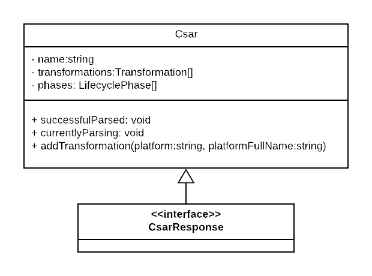
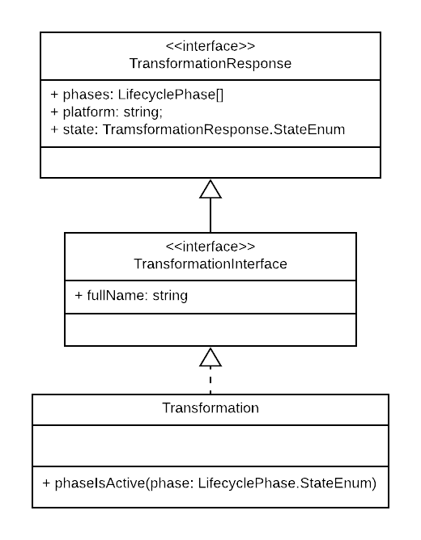
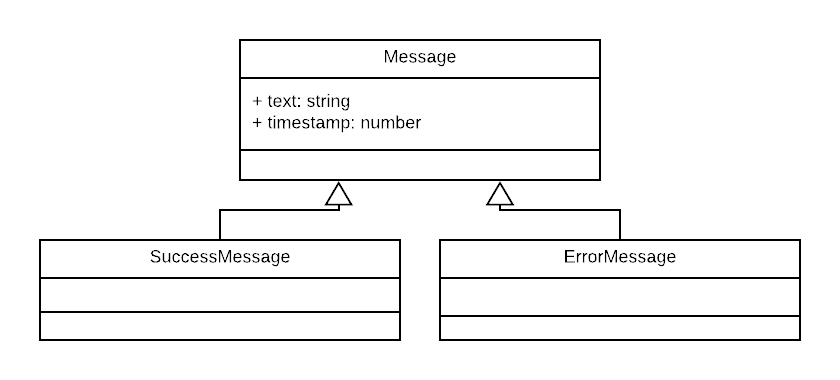
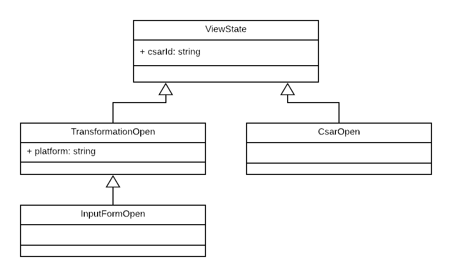

# Model

The web app mostly uses the by swagger-codegen generated model. There fore only a few classes are shown in the following document.

## Csar

The *Csar*-Class implements the generated *CsarResponse*-Interface. 
It has some convenience methods like `successfulParsed` and `currentlyParsing`.

## Transformation

## Health

The auto generation failed to create proper interfaces for the health stats. There fore we created our own interfaces.

## Message

To show the user messages we needed an Message model.

## ViewState

The view states are used to store the current opened view, this helps realizing the items in the sidebar.

