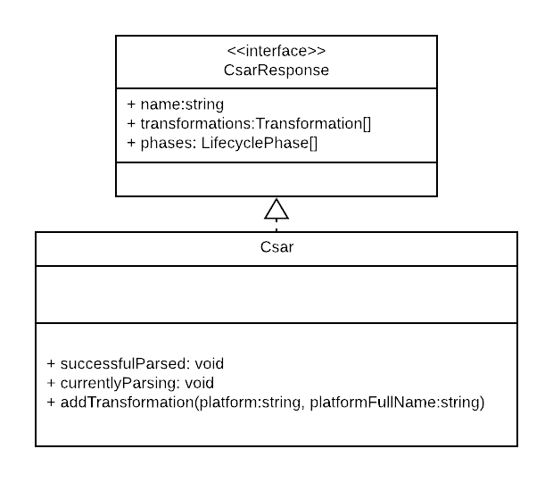
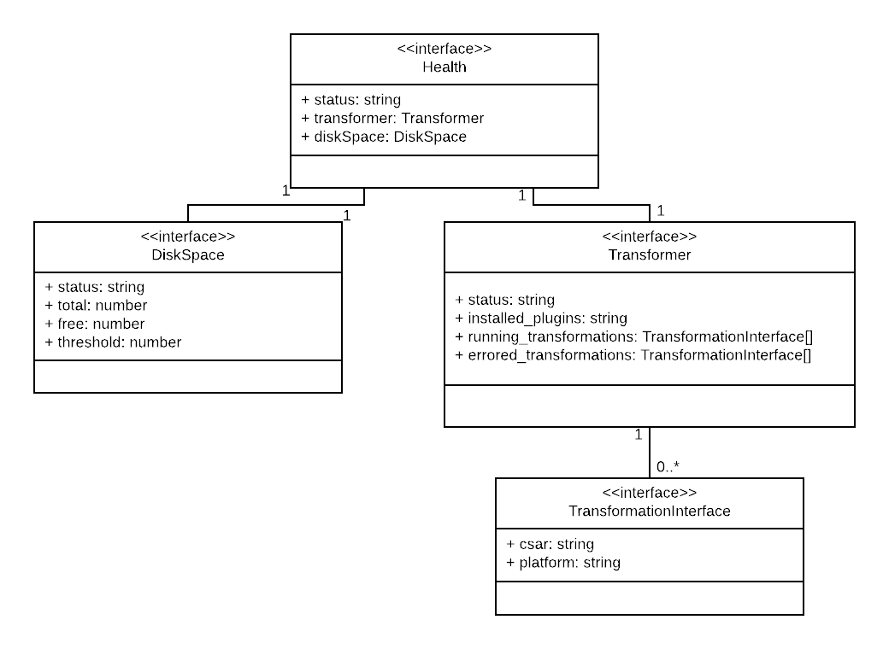

# Model

The web app mostly uses the by swagger-codegen generated model. There fore only a few classes are shown in the following document.

# Csar

The *Csar*-Class implements the generated *CsarResponse*-Interface. 
It has some convenience methods like `successfulParsed` and `currentlyParsing`.

# Health

The auto generation failed to create proper interfaces for the health stats. There fore we created our own interfaces.

