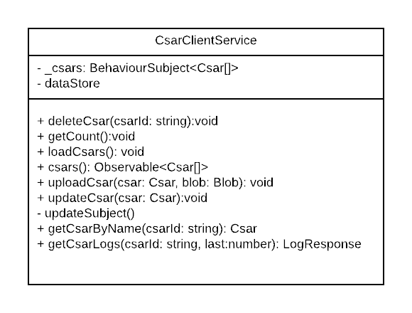
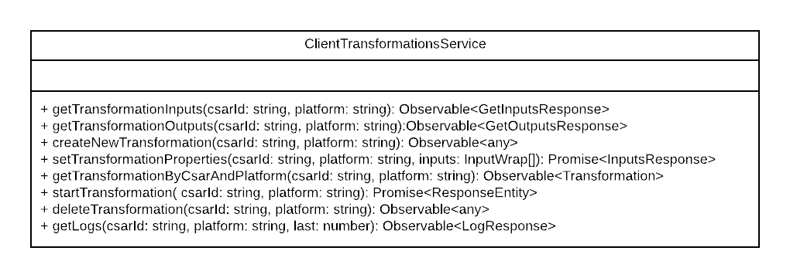
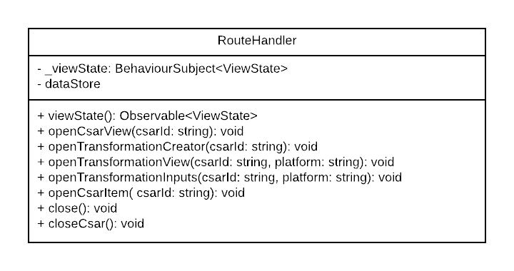
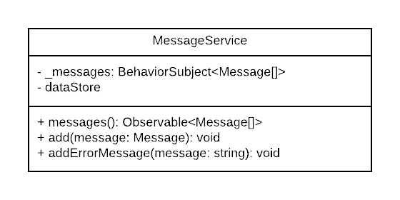
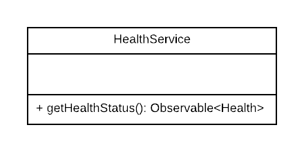
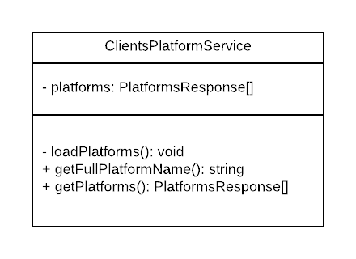

# Services

Most of the services are wrappers around the by swagger-codegen auto-generated services.

## ClientCsarsService



The ClientCsarsService is responsible for all operations that have to do with CSARs.
It uses [RxJS](http://reactivex.io/rxjs/) to provide changes and new CSARs to all Components that are interested in. 

How can a component use the ClientCsarsService:

Add the service to the constructor:
```js
constructor(csarService: ClientCsarsService){
}
```

Get the Observable:
```js
constructor(csarService: ClientCsarsService){
    let observable = csarService.csars;
}
```

Then subscribe and handle incoming csars:
```js
constructor(csarService: ClientCsarsService){
    let observable = csarService.csars;
    observable.subscribe(csars => {
            console.log(csars);
    });
}
```
The body of `subscribe()` is always called if there are new CSARs.
    
## ClientTransformationsService



Most of the methods in the ClientTransformationsService are just wrapping the methods of the auto-generated transformations service.
This was necessary to avoid refactoring the whole web app if the REST API changes.

## RouteHandler



The RouteHandler uses like the ClientCsarsService [RxJS](http://reactivex.io/rxjs/) to notify subscribers about a new view state.

Here are some examples how the RouteHandler can be used:

Open the TransformationCreator:
```
this.routeHandler.openTransformationView("lamp-input", "kubernets");
```

Listen on view changes:
```
this.routeHandler.viewState.subscribe(viewState => {
    if(viewState instanceof TransformationOpen) {
        // do somethings that has to be done if the TransformationView is opened
    }
})
```

## MessageService



The MessageService uses like the ClientCsarsService and the RouteHandler [RxJS](http://reactivex.io/rxjs/) to notify the MessageComponent about new messages.

## HealthService



The HealthService exists because the auto-generated API bindings failed to provide a working health service.

## ClientPlatformsService



The ClientPlatformsService loads all platforms once and holds them in memory. This avoids loading the platforms every time they are needed.

