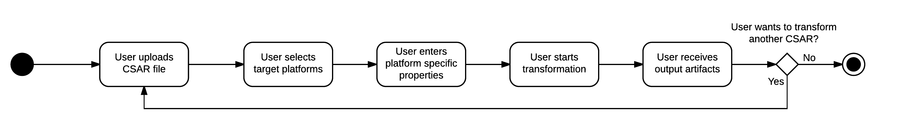

# TOSCAna API Documentation

## Use-Case

The functionality of the API is designed around the following Workflow:

**Note**: The diagram has been made using LucidCharts. The source document can be found [here](https://www.lucidchart.com/invitations/accept/b45c6d0f-0205-4049-9921-4cd888129157).

Following this diagram the user first has to upload the Cloud Service Archive (CSAR) on the transformator. 

Once the upload is finished the user has to choose one or more of the supported platforms. In the first revisions of the transformator this will be limited to one platform per transformation. At this point the user also has to enter platform specific parameters.
For example the user would have to select a Docker Registry and enter the corresponding credentials for it when selecting Kubernetes as one of the Target platforms.
After entering the inputs they get validated by the corresponding platform plugin. If the inputs are valid (i.e. credentials are valid) the transformation process starts.
if the inputs are invalid the user is requested to update them.

While the transformation is running the user can request log outputs from the Transformator. A progress value (from 0 to 100) can also be recieved. A time estimate feature is not planned.

Once the transformation has finished succesfully the user will be able to download the artifacts created by the transformation.

## Design prinicpals

### Used frameworks (Backend)