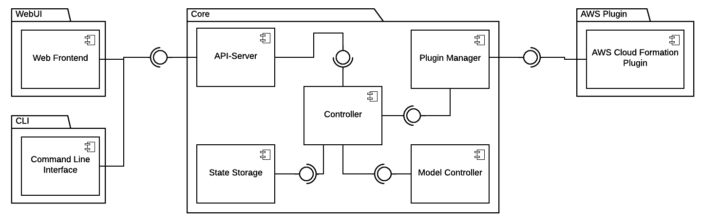

# TOSCAna Architecture

## Component Diagram

The following component diagram describes the architecture of the TOSCAna Transformator.

***Note:*** This diagram was created using LucidChart. The source file can be found [here](https://www.lucidchart.com/invitations/accept/65f6e322-d8a2-4645-850f-e8f2893fc408).

### Core Package

The core package contains all core components of the transformator.

#### Controller

The controller represents the main component in the core package. 

#### API-Server

The API-Server hosts a REST-based API. The CLI and Web Frontend will connect to the Core Application using the provided REST-API. 

##### Open Questions

- What framework will be used to implement the REST-API? 

#### Data-Storage

The persistent 

#### Plugin Manager

### CLI

### WebUI

### AWS Plugin

