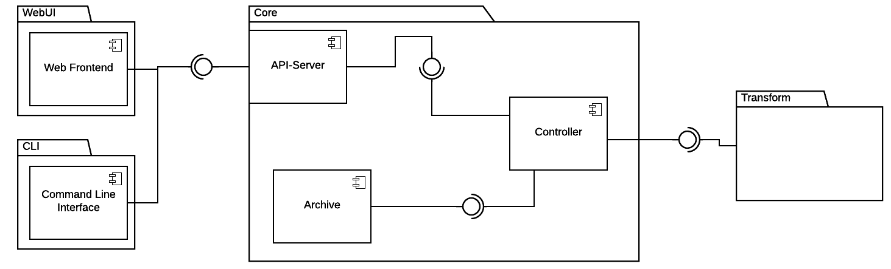

# TOSCAna Architecture

## Component Diagram

The following component diagram describes the architecture of the TOSCAna Transformator.

***Note:*** This diagram was created using LucidChart. The source file can be found [here](https://www.lucidchart.com/invitations/accept/65f6e322-d8a2-4645-850f-e8f2893fc408).

### Core Package

The core package contains all core components of the **TOSCAna** application.

#### Controller

The controller represents the main component in the core package.
It connects the Rest-API with the persistent storage (archive) and the transform component.

#### API-Server

The API-Server hosts a REST-based API. The CLI and Web Frontend will connect to the Core Application using the provided REST-API.

### Archive

The archive represents the interface between the core and the persistent storage.
The base folder is the `csar`-folder which contains all apps. There will be an individual folder for each app, named by the the apps name. So for a app named "lamp-stack" the folder path will be `csars/lamp-stack/`.
Each app folder contains the `platform` folder. In the `platform` folder you can find subfolders for every platform the app was transformed to. The names for the subfolders will be the short form of the platforms name. "Amazon Web Services" as platform will result into the following folder structure: `csars/lamp-stack/platforms/aws/`.

##### Open Questions

- What framework will be used to implement the REST-API?

#### Open Questions and Ideas

- How will the state data be stored persistently (Not the CSAR)?
    - Maybe use a integrated DBMS like H2 or Apache Derby, However this point has to be discussed in the group and maybe even with the customer. If the persistent storing of the state is not necessary this component is pretty much useless.

Its important to note, that the Data-Storage component does not store the CSAR Uploaded using the API this has to be stored somewhere in the Filesystem.
   
### CLI

### WebUI

### AWS Plugin
