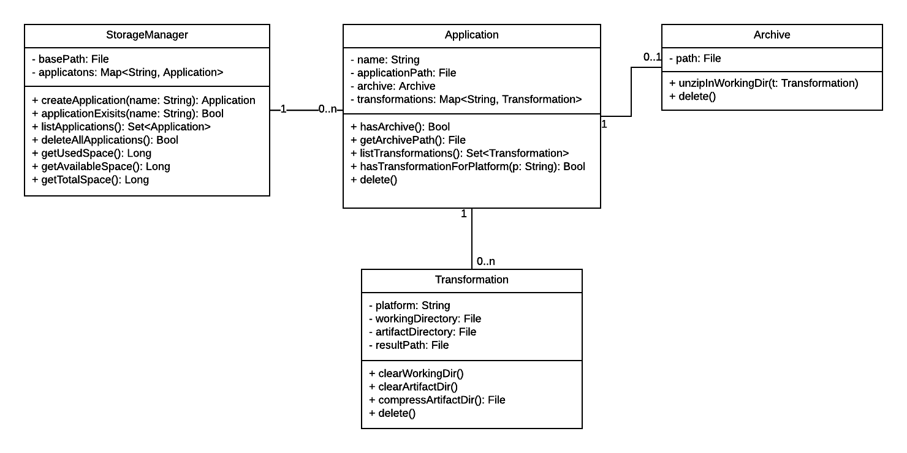

#Storage Specification
This document describes the functionality of the Storage component (fomerly known as archive).

The main task of the storage component is to persistently manage all CSAR (Cloud Service Archive) archives stored on the server and the transformations executed on them.
It also provides Working directories for running transformations.

Given a directory (with read and write access) the storage component will be able to load and create a file structure to achieve the tasks described above.

## Class Diagram

***Note:*** This diagram was created using LucidChart. The source file can be found [here](https://www.lucidchart.com/invitations/accept/6cd9081f-fe92-4ff0-af0f-cf15839c7641).

