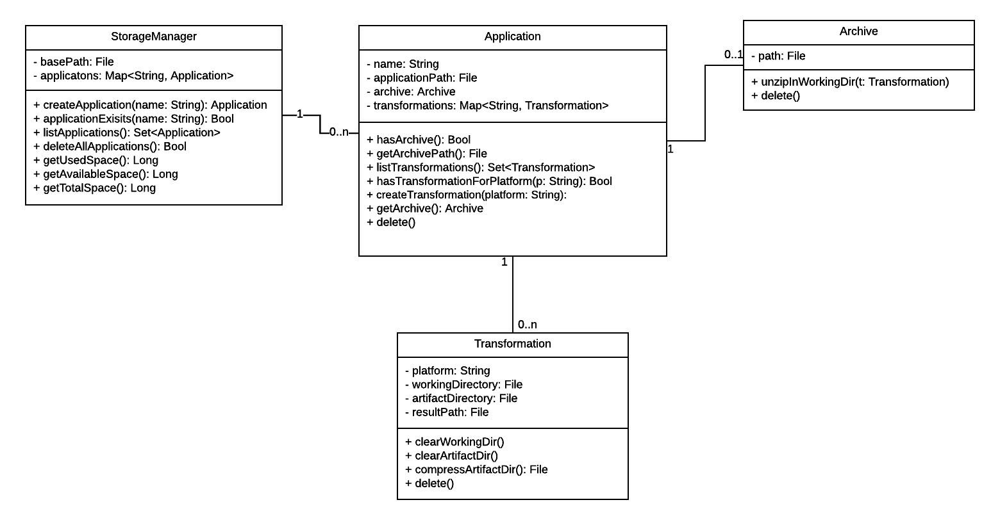

# Storage Specification
This document describes the functionality of the Storage component (fomerly known as archive).

The main task of the storage component is to persistently manage all CSAR (Cloud Service Archive) archives stored on the server and the transformations executed on them.
It also provides Working directories for running transformations.

Given a directory (with read and write access) the storage component will be able to load and create a file structure to achieve the tasks described above.

## Class Diagram

***Note:*** This diagram was created using LucidChart. The source file can be found [here](https://www.lucidchart.com/invitations/accept/6cd9081f-fe92-4ff0-af0f-cf15839c7641).

### StorageManager

The StorageManager is the Top level class of the storage component, given a empty directory or a non existing path the StorageManager will try to initialize a new environment for storing CSAR arives and transformations. However it must be ensured that the user executing the TOSCAna application has read and write permissions on the given directory.

When a storage manager gets created on a empty directory the following files and directories will be created:

```
/
   - applications/
   - toscana-storage.json
```

* `applications/` - subdirectory to store all files specific for applications (always exists)
* `toscana-storage.json` - this json file is used to identify this folder as a TOSCAna data folder, it might be used to store manager specific data at a later point. (always exists, might just contain `{}`)

If a StorageManager gets created for a previously initialized path the storage manager will reload the data persisted in the folder and its substructure.

The methods shown in the above class diagram have the following functionality:
* `createApplication(name: String): Application` - Creates a new Application Object (see Application) if the name is valid and not in use already. Otherwise a Exception gets thrown
* `applicationExists(name: String): Bool` - Checks if a application with the given name exists and returns true if that's the case and false otherwise.
* `listApplications(): Set<Application>` - Returns a set (list) of all applications stored by this storage manager instance
* `deleteAllApplications(): Bool` - Deletes all applications and the files belonging to them. If the operation was successful true gets returned and false otherwise.
* `getUsedSpace(): Long` - Returns the used hard disk space (in bytes) of the hard disk on which the StorageManager's directory is located
* `getAvailableSpace(): Long` - Returns the available hard disk space (in bytes) of the hard disk on which the StorageManager's directory is located
* `getTotalSpace(): Long` - Returns the total hard disk space (in bytes) of the hard disk on which the StorageManager's directory is located

### Application

To store a CSAR a application object is created, this object will create a subdirectory of the ``applications`` folder with the unique name supplied in the `createApplication(String)` method of the StorageManager, this also is the only way to create a Application object from outside the package.

The Directory Structure of a Application Object looks like this:
```
/applications/{applicationName}/
   - transformations/
   - archive.csar
   - properties.json
```

* `transformations/` - subdirectory to store all files specific to the transformations (always exists)
* `archive.csar` - the CSAR that belongs to this application (does not have to exist)
* `properties.json` - this file is used to store Application specific properties (always exists, might just contain `{}`)

The methods shown in the above class diagram have the following functionality:
* `hasArchive(): Bool` - Returns true if the `archive.csar` file exists (has been uploaded by the user)
* `getArchivePath(): File` - Returns the File Object pointing to the `archive.csar` this can be used to get the path and then write the archives contents to it
* `listTransformations(): Set<Transformations>` - Returns a set (list) of all transformations for this application
* `hasTransformationForPlatform(platform: String): Bool` - Returns true if a transformation for the given platform name exists.
* `createTransformation(platform: String): Transformation` - Creates a new Transformation object for the given platform. if the platform name does not match the naming conventions or a transformation to this platform already exists a execption is thrown,
* `getArchive(): Archive` - Returns the Archive wrapper object for the `archive.csar` file
* `delete()` - Deletes the Application object and the files belonging to it.

### Archive

### Transformation

## Open Questions

* How will Properties get stored? JSON serialisation, Java Properties or maybe something completely different
* How should the extraction of the CSAR be handled? Once per transformation or only once (after the upload, for all transformations)
* Should the delete messages return true if they succeed or throw a exception if they fail? 
* Naming conventions for names of applications and platforms. Maybe lowercase letters, digits and ``-``?
