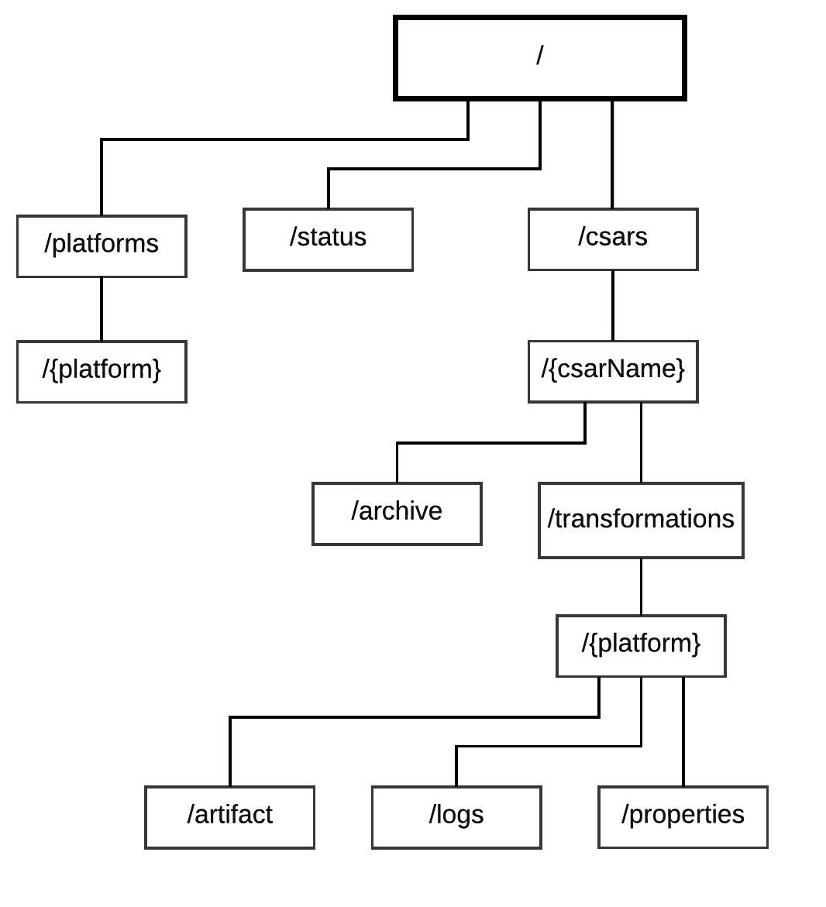

# Specification of the REST-api
**Note:** Terms in curly braces like {csarName} and {platformName} are meant to be substituted with a proper value.
They must not be used literally.



### Current status
##### GET /status
Get the current status of the transformer.

*Returns:* HTTP Response Code: 200 (always)

```json
{
    "_links": {
        "self": { "href": "/status" }
    },
    "status": "idle",
    "available_storage": 1000,
    "total_storage": 10000
}
```
- `_links`: contains links to resources
    - `self`: link to self
- `status`: current status of the transformer, values can be [`idle`, `transforming`, `error`]
- `available_storage`: free hard disk storage (integer, in MB)
- `total_storage`: total hard disk storage (integer, in MB)

### Manage target platforms

##### GET /platforms
Return all target platforms which are available for transforming the CSAR.

*Returns:*
```json
{
    "_links": {
        "self": { "href": "/platforms" },
    },
    "_embedded": {
        "platform": [{
            "_links": {
                "self": { "href": "/platforms/aws" }
            }
         }, {
            "_links": {
                "self": { "href": "/platforms/cloudformation" }
            }
        }]
     }
}
```
- `_links`: contains links to resources
    - `self`: link to self
- `_embedded`: resources contained within

**Note:** It is possible to add platform specific preferences here later.

### Manipulating csars

##### GET /csars
Get a list of all applications.

*Returns*:
```json
{
    "_links": {
        "self": { "href": "/csars" },
        "next": { "href": "/csars?page=2"}
        "findApp": {
            "href": "/csars/{csarName}",
            "templated": true
        }
    },
    "_embedded": {
       "app": [{
            "_links": {
                "self": { "href": "/csars/hello-world" },
                "archive": { "href": "/csars/hello-world/archive" },
                "transformations": { "href": "/csars/hello-world/transformations" }
            },
            "name": "hello-world"
        }, {
            "_links": {
                "self": { "href": "/csars/billing-app" },
                "archive": { "href":"/csars/billing-app/archive" },
                "transformations": { "href": "/csars/billing-app/transformations" }
            },
            "name": "billing-app"
        }]
     }
}
```
- `_links`: contains links to resources
    - `self`: link to self
    - `next`: link to the next page of csars
    - `findApp`: template containing the variable "csarName", which can be used with the specific app name to get directly to that app
- `_embedded`: resources contained within


##### POST /csars
Create a new application. Returns a link to the new resource.

*Request body:*
```json
{
    "name": "{csarName}"
}
```

*Returns*: `201 - created`
```json
{
    "_links": {
        "self": { "href": "/csars/{csarName}" },
        "archive": { "href": "/csars/{csarName}/archive" },
        "transformations": { "href": "/csars/{csarName}/transformations" }
    },
    "name": "{csarName}"
}
```
- `_links`: contains links to resources
    - `self`: link to self
    - `archive`: link to CSAR of the application
    - `transformations`: link to transformations of the application
- `name`: name (String) of the application used for representation. Must be unique. Allowed characters: [a-z0-9_-]. Upper case letters are automatically converted to lower case.

*Errors*:
`422` - `name` value already in use by other application

##### DELETE /csars
Delete all applications

##### GET /csars/{csarName}
Get the application which name matches {csarName}.

*Returns*:
```json
{
    "_links": {
        "self": { "href": "/csars/{csarName}" },
        "archive": { "href": "/csars/{csarName}/archive" },
        "transformations": { "href": "/csars/{csarName}/transformations" }
    },
    "name": "{csarName}"
}
```
*Errors*:
`404` - application with given {csarName} does not exist

##### PUT /csars/{csarName}
Update the application which name matches given {csarName}.

*Returns:* Nothing

*Errors*:
`404` - application with given {csarName} does not exist
`422` - `name` value already in use by other application

##### DELETE /csars/{csarName}
Delete the application which name matches given {csarName}

*Returns:* Nothing

*Errors:*
`404` - application with given {csarName} does not exist

## Manipulating CSARs
##### PUT /csars/{csarName}/archive
Uploads a CSAR.

*Request body*:
Raw CSAR file content

*Returns:* `203`

*Errors:*
`400` - Uploaded file is not a valid CSAR, rejected
`404` - application with given {csarName} does not exist
`507` - Insufficient storage

##### DELETE /csars/{csarName}/archive
Deletes the CSAR of the application which matches given {csarName}.

*Returns:* Nothing

### Managing transformations

##### GET /csars/{csarName}/transformations
Returns a list of all ongoing or finished transformations of given application.

*Returns:*
```json
{
    "_links": {
        "self": { "href": "/csars/{csarName}/transformations/" },
    },
    "_embedded": {
        "transformation": [{
            "_links": {
                "self": { "href": "/csars/{csarName}/transformations/{platformName}" },
            ...
            },
            "status": ...
            ...
        }]
    },
    ..
}
```
- `_links`: contains links to resources
    - `self`: link to self
- `_embedded`: resources contained within

See below for details of the format of a transformation.

##### GET /csars/{csarName}/transformations/{platformName}
Returns the transformation of the specifified application which name matches given {platformName}.

*Returns:*
```json
{
    "_links": {
        "self": { "href": "/csars/{csarName}/transformations/{platformName}" },
        "platform": { "href": "/platforms/{platformName}" },
        "artifact": { "href": "/csars/{csarName}/transformations/{platformName}/artifact" },
        "logs": { "href": "/csars/{csarName}/transformations/{platformName}/logs" },
        "properties": { "href": "/csars/{csarName}/transformations/{platformName}/properties" }
    },
    "status": "input-required",
    "progress": 0
}
```
- `_links`: contains links to resources
    - `self`: link to self
    - `platform`: link to target platform
    - `artifact`: link to target platform artifact
- `status`: status of the transformation, values can be [`input-required`, `ready`, `queued`, `transforming`, `done`, ` stopped`, `failed`]
    - `input-required`: before the transformation can start, the user has to specify some values
    - `ready`: ready for transformation
    - `queued`: server is currently busy, the transformation is queued and will eventually start
    - `transforming`: transformation is currently ongoing
    - `done`: transformation is successfully finished
    - `canceled`: transformation got canceled by a client
    - `failed`: transformation failed due to an error
- `progress`: progress of the  transformation in percentage (integer, [0-100]). Can only change in the status `transforming`.

##### PUT /csars/{csarName}/transformations/{platformName}
Request the transformation of the specified application to the specified platform.
If a transformation has already started for the particular platform, the server will abort and restart the transformation.

*Returns:* `201` Created
(immediately - **Note:** This does not mean that the transformation is finished.)

*Errors:*
`423` - Locked: transformation not ready but in state "input-required"

##### DELETE /csars/{csarName}/transformations/{platformName}
Halts the specified transformation.

*Postcondition:* Status of specified transformation is "canceled"

*Errors:*
`404` - transformation doesn't exit (application oder platform does not exist)


### Reading transformation logs
##### GET /csars/{csarName}/transformations/{platformName}/logs/
Receive the logs for specified transformation. All logs starting with the {start}nth to the most recent log are transfered.

*Request body:*
```json
{
    "start":0
}
```
- start - index of first log to receive

*returns:*
```json
{
    "end": 53,
    "logs": ["line1","line2",...]
}
```
- end: the index of the last log line
- logs: array of log lines (order: oldest first)

*Example*:
1. Client calls GET .../logs?start=0
2. Server answers with
```json
{
    "end": 3,
    "logs": ["line1","line2","line3","line4"]
}
```
3. Client calls GET .../logs?start=4
4. etc

**Note**: If no new log lines are available, then an empty array is returned and end stays at the same point:

*Example*:
1. Client calls GET .../logs?start=4
2. Server answers with
```json
{
    "end": 3,
    "logs": []
}
```
3. Client calls GET .../logs?start=4
4. etc

### Downloading platform artifacts
##### GET /csars/{csarName}/transformations/{platformName}/artifact
Downloads the deployment artifact for specified platform and application.

*Errors:*
`404` - The artifact does not exist

### Specifying additional user input

If the transformation status changes to `input-required` the transformator needs additonal data from the client in order to perform the transformation.

To get information about required data, call:
```
GET /csars/{csarName}/transformations/{platformName}/properties
```
*returns:*
```json
[{
    "Database Password": {
        "type": "string",
        "value": null,
        "valid": false
    },
    "timeout": {
        "type": "integer",
        "value": null,
        "valid": false
    }
}]
```
- `Object Names`: Key which requires a value
- `type`: the value needs to be of this type (must be one of [string, integer, float]
- `value`: In the response, this field needs to be set with a value of wanted type
- `valid`: if false, server rejects value. All key value pairs must be valid in order for the transformation to happen.

*Errors:*
`404` - if the transformation is not found (hence application name or plaform is invalid)

##### PUT /csars/{csarName}/transformations/{platformName}/properties
Call this in order to specify the values for required keys. Calling this will automatically trigger a GET call to the same resource as the response (in order to validate the input).

*Request body*:
```json
[{
    "Database Password": "securePassword",
    "timeout": 5
}]
```
*Returns:*
```json
[{
    "Database Password": {
        "type":"string",
        "value":"securePassword",
        "valid":true
    },
    "timeout": {
        "type":"integer",
        "value":5,
        "valid":true
    }
}]
```
