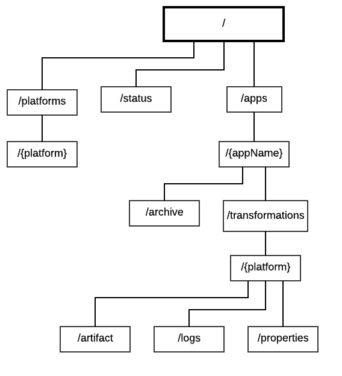

# Alternative draft for the REST api

```java
Note:
Terms in curly braces like {appName} are meant to be substituted with a proper value. 
They must not be used literally.
```

### Current status
##### GET /status
Get the current status of the transformer.
*returns:* HTTP Response Code: 200 (always)

```json
{
    "status": "idle",
    "available_storage": 1000,
    "total_storage": 10000,
}
```
- *status*: current status of the transformer, values can either be `idle`, `transforming` or `error`
- *available_storage*: free hard disk storage in MB (integer)
- *total_storage*: total storage of the hard disk (integer, in MB)

### Manage target platforms

##### GET /platforms
Returns all target platforms which are available for transforming the CSAR.

*returns:*
```json
[ 
    "aws": {
        "href":"/platforms/aws"
    },
    "cloudformation": {
        "href":"/platforms/cloudformation"
    }
]
```
NOTE: Later it is possible to add platform specific preferences here

### Manipulating TOSCA Models

##### GET /toscamodels
Get a list of all toscamodels.  

*returns*:
```json
[
    {
        "href":"/toscamodels/hello-world",
        "name":"hello-world",
        "csar": {
            "href":"/toscamodels/hello-world/csar"
        },
        "transformations": {
            "href":"/toscamodels/hello-world/transformations"
        }
    },
    {
        "href":"/toscamodels/billing-app",
        "name":"billing-app",
        "csar": {
            "href":"/toscamodels/billing-app/csar"
        },
        "transformations": {
            "href":"/toscamodels/billing-app/transformations"
        }
    }
]
```
##### POST /toscamodels
Create a new TOSCA model. Returns a link to the new resource.

*Request body:*  
```json
{
    "name":"{appName}"
}
```
- name: name (String) of the application used for representation. Must be unique. Allowed characters: [a-z0-9_-]. Upper case letters are automatically converted to lower case.

*returns*: `201 - created`
```
{
    "href":"/toscamodels/billing-app",
    "name":"billing-app",
    "csar": {
        "href":"/toscamodels/billing-app/csar"
    },
    "transformations": {
        "href":"/toscamodels/billing-app/transformations"
    }
}
```

*ERRORS*:  
`422` - `name` value already in use by other toscamodel

##### DELETE /toscamodels
Delete all TOSCA models

##### GET /toscamodels/{appName}
Get the TOSCA model which name matches {appName}.

*returns*:
```json
{
    "href":"/toscamodels/{appName}",
    "name":"AppName"
    "csar": {
        "href":"/toscamodels/{appName}/csar"
    },
    "transformations": {
        "href":"/toscamodels/{appName}/transformations"
    }
}
```
*ERRORS*:  
404 - TOSCA model with given {appName} does not exist

##### PUT /toscamodels/{appName}
Update the TOSCA model which name matches given {appName}.

*returns:* Nothing

*ERRORS*:  
`404` - TOSCA model with given {appName} does not exist  
`422` - `name` value already in use by other toscamodel

##### DELETE /toscamodels/{appName}
Delete the TOSCA model which name matches given {appName}

*returns:* Nothing

*ERRORS:*  
`404` - TOSCA model with given {appName} does not exist

## Manipulating CSARs
##### PUT /toscamodels/{appName}/csar
Uploads a CSAR.
*Required request body*:
Raw csar file content

*returns:* `203`

*ERRORS:*  
`400` - Uploaded file is not a valid CSAR, rejected  
`404` - TOSCA model with given {appName} does not exist  
`507` - Insufficient storage  

##### DELETE /toscamodels/{appName}/csar
Deletes the csar of the toscamodel which matches given {appName}.

*returns:* Nothing

### Managing transformations

##### GET /toscamodels/{appName}/transformations
Returns a list of all ongoing or finished transformations of given TOSCA model.

*returns:*
```json
[
    "{platform}": {
        "href": "/toscamodels/{appName}/transformations/{platform}",
        "status": ...
        ...

    },
..
]
```
See below for details of the format of a transformation.

##### GET /toscamodels/{appName}/transformations/{platform}
Returns the transformation of the specifified TOSCA model which name matches given {platform}.

*returns:*
```json
{
    "href":"/toscamodels/{appName}/transformations/{platform}"
    "platform": {
        "href": "/platforms/{platform}"
    },
    "artifact": {
        "href": "/toscamodels/{appName}/transformations/{platform}/artifact"
    },
    "status":"user-input",
    "progress":0
}
```
- href: link to self
- platform: link to target platform
- artifact: link to target platform artifact
- status: ["user-input","ready","queued","transforming","done","stopped","failed"]
    - user-input: before transformation can start, user has to specify some values
    - ready: ready for transformation
    - queued: server is currently busy, transformation is queued and will eventually start
    - transforming: transformation is currently ongoing
    - done: transformation is successfully finished
    - canceled: transformation got canceled by a client
    - failed: transformation failed due to an error
- progress: int, [0-100], progresss of transformation in percentage. Can only change in status "transforming"

##### PUT /toscamodels/{appName}/transformations/{platform}
Request the transformation of the specified TOSCA model to the specified platform.
If already started a transformation to the particular platform, server will abort and restart transformation.

*returns:* `201` Created (immediately - note this does not mean
that the transformation is finished)
*ERRORS*:  
`423` - Locked: transformation not ready but in state "user-input"

##### DELETE /toscamodels/{appName}/transformations/{platform}
Halts the specified transformation.

*Postcondition:* Status of specified transformation is "canceled"

*ERRORS:*  
`404` - transformation doesn't exit (TOSCA model oder platform does not exist)

### Reading transformation logs
##### GET /toscamodels/{appName}/transformations/{platform}/logs/
Receive the logs for specified transformation. All logs starting with the {start}nth to the most recent log are transfered.

*Request body:*
```json
{
    "start":0
}
```
- start - index of first log to receive

*returns:*
```json
{
    "end":53,
    "logs":["line1","line2",...]
}
```
- end: the index of the last log line
- logs: array of log lines (order: oldest first)

*ERRORS:*  
`400` - start index out of bounds
`404` - no logs available

*EXAMPLE*:
1. Client calls GET .../logs?start=0
2. Server answers with
```json
{
    "end":3,
    "logs:["line1","line2","line3","line4"]
}
```
3. Client calls GET .../logs?start=4
4. etc
### Downloading platform artifacts
##### GET /toscamodels/{appName}/transformations/{platform}/artifact
Downloads the deployment artifact for specified platform and TOSCA model.

*ERRORS:*  
`404` - The artifact does not exist

### Specifying additional user-input

If the transformation status changes to `user-input` the transformator needs additonal data from the client in order to perform the transformation.

To get information about required data, call:
```
GET /toscamodel/{appName}/transformations/{platform}/properties
```
*returns:*  
```json
[
    "Database Password": {
        "type":"string",
        "value":null,
        "valid":false
    },
    "timeout": {
        "type":"integer",
        "value":null,
        "valid":false
    }
]
```
- Object Names: Key which requires a value
- type: the value needs to be of this type (must be one of [string,uinteger,integer,float]
- value: In the response, this field needs to be set with a value of wanted type
- valid: if false, server rejects value. All key value pairs must be valid in order for the transformation to happen.

*ERRORS:*  
`404` - if the transformation is not found (hence TOSCA model name or plaform is invalid)

##### PUT /toscamodel/{appName}/transformations/{platform}/properties
Call this in order to specify the values for required keys. Calling this will automatically trigger an GET call to the same resource as response (in order to validate input).

*Request body*:
```json
[
    "Database Password":"securePassword",
    "timeout":5
]
```
*returns:*
```json
[
    "Database Password": {
        "type":"string",
        "value":"securePassword",
        "valid":true
    },
    "timeout": {
        "type":"integer",
        "value":5,
        "valid":true
    }
]
```

