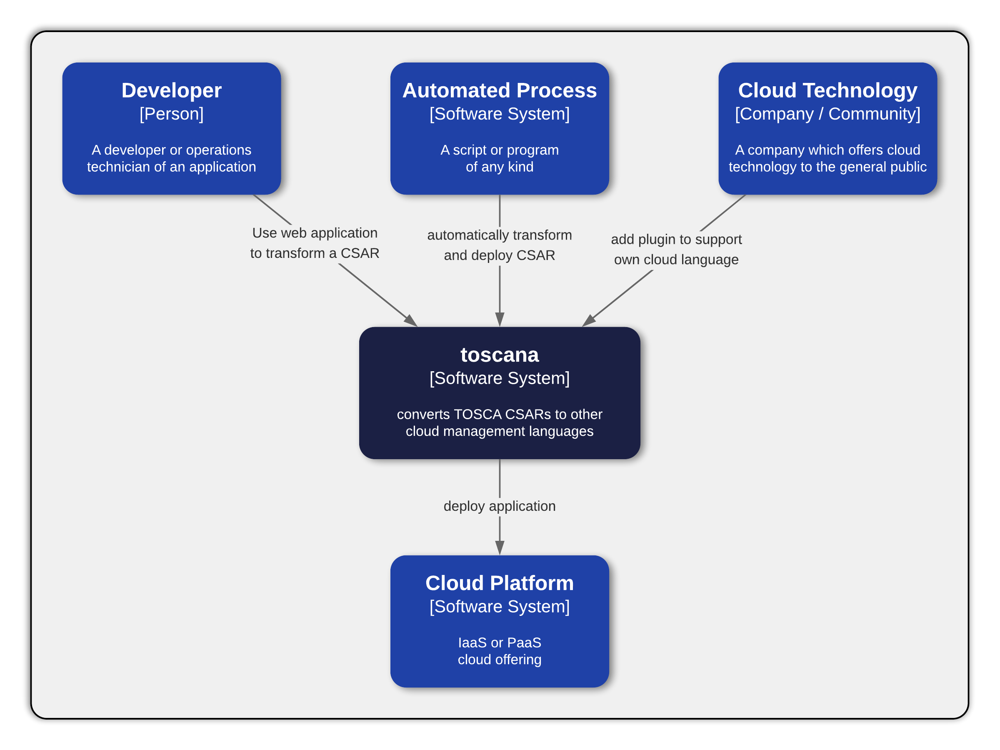

# Home

TOSCAna is open source project developed by students at the university of Stuttgart.

## Purpose

The TOSCA modelling language allows everyone to create a model of their system architecture that later can be deployed by a orchestrator.
But what if the user has an existing model and wants to transform it to the modelling language of a platform like Kubernetes?
This is where TOSCAna comes in, it provides the functionality to transform a CSAR created by the latest TOSCA spec to a platform of your choice.

## Strengths

For end users TOSCAna already comes with a web application, were the they can upload CSARs, create transformations and do much more. 
Users calling the terminal their home can do the same things using the CLI.

Due to the modular approach developers can add their own platforms.
The REST API allows to develop much more applications that can make use of TOSCAna, like mobile apps.

## Weaknesses

Currently TOSCAna only contains three platforms: Amazon Cloud Formation, Cloud Foundry and Kubernetes.
The platforms themselves are very limited regarding the supported node types.
Currently they only support the most common node types and use cases.

