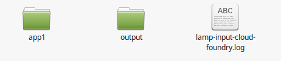
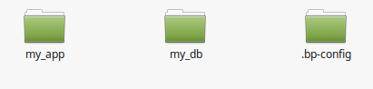
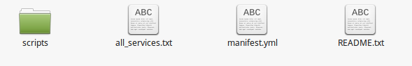
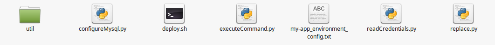
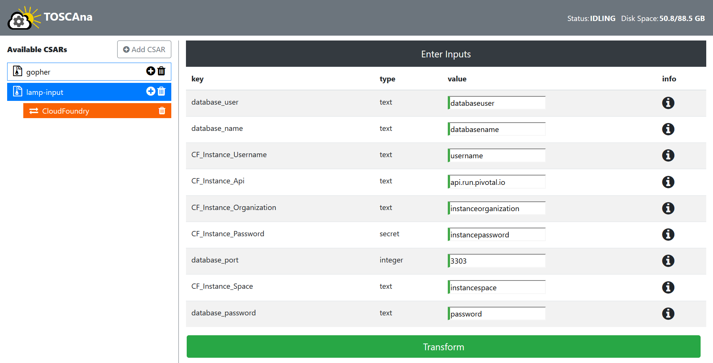

# Cloud Foundry Plugin

## Introduction
The Cloud Foundry Plugin transforms a CSAR to an artifact, that can be deployed on the Cloud Foundry Platform. In general the following steps have to be done to transform and deploy a CSAR:

1. upload CSAR with the GUI/ CLI
2. select Platform CloudFoundry
3. enter required Inputs
4. start Transformation
5. download artifact
6. unzip at target location
7. start deploying with with execution of deploy.sh found in output/scripts/ in target artifact

Before the Transformation can start the Cloud Foundry credentials and additional properties have to be set:

- `CF_Instance_Username`: Username of CloudFoundry user account
- `CF_Instance_Api`: The endpoint of the provider
- `CF_Instance_Organization`: The organization of the user account which should be used to deploy
- `CF_Instance_Password`: Password of CloudFoundry user account
- `CF_Instance_Space`: The space of the user account which should be used to deploy

The credentials are used to get a list of services which can be used for deployment.
For more details on supported NoteTypes, basics of Cloud Foundry, the Transformation and created scripts, see the documents in `dev/plugins/cloudFoundry`.

## Artifact
The Artifact is the result of the transformation which contains all necessary files which are needed to deploy an application on Cloud Foundry. After you open the Artifact you can see the log of the Transformation, the app folder(s) which contain your application and the output folder which contains the files for deployment. If you provide multiple applications in your CSAR the artifact will contain multiple app folders called app1, app2 and so on.



App folder: The .bp-config folder in this case contains buildpack additions for a php application, which needs some additional buildpacks.



The output folder contains a scripts folder and the files all_services.txt, manifest.yml, README.txt.



Scripts folder:



The Plugin tries to find free services available on the Cloud Foundry Platform to provide support for your modeled NodeTypes which are declared as services. They can be changed to paid plans. To see what additions a paid plan brings, please check your Cloud Foundry provider. You can see a list of all available services and corresponding plans in all_services.txt in the output folder.

For example if you want to change a database plan for the service cleardb (available on Pivotal Cloud Foundry), open `deploy.sh` in output/scripts/ and change `cf create-service cleardb spark my_db` from the free spark plan to boost, amp or shock: `cf create-service cleardb shock my_db`. For more information about the output folder see README.txt.

## Requirements for Deployment
Before you can use the artifact to deploy, there are some requirements:
- Cloud Foundry is running on target infrastructure
- the Cloud Foundry CLI is installed on the local machine
Linux installation (other Systems: [Install CF CLI](https://docs.cloudfoundry.org/cf-cli/install-go-cli.html)):

```
wget -q -O - https://packages.cloudfoundry.org/debian/cli.cloudfoundry.org.key | sudo apt-key add -
echo "deb https://packages.cloudfoundry.org/debian stable main" | sudo tee /etc/apt/sources.list.d/cloudfoundry-cli.list
sudo apt-get update
sudo apt-get install cf-cli
```

- python 2.7 or newer is installed on the local machine
- If the application contains databases, there needs to be an environment variable with the name `database_host` in the CSAR manifest.

## Deployment
To deploy an application, log into Cloud Foundry with the Cloud Foundry CLI (more information [Here](https://docs.cloudfoundry.org/cf-cli/getting-started.html)).

```
cf login -a https://api.example.com -u username@example.com
```

- Unzip at target location

- Move into the /output/scripts/ folder and execute `deploy.sh`:

```
chmod +x deploy.sh
./deploy.sh
```

## Supported Test-CSARs
The following CSARs can be used to test the Cloud Foundry Plugin:

- lamp-input
- lamp-multinode
- lamp-noinput
- task-translator

These CSARs can be found in `TOSCAna/server/src/test/resources/csars/yaml/valid`

## Doing a Transformation with a Test-CSAR
The Lamp-input CSAR is used in this example, make sure you have done all the things from `Requirements for Deployment`. For details on how to use the GUI, see the Webapp User guide.
After you upload the CSAR to the GUI and select the Cloud Foundry platform as the target you get the following inputs screen (we use Pivotal CF as endpoint here):



Enter the needed inputs, click on Transform, wait for the Transformation to finish and download the artifact afterwards.
Now follow the steps described under `Deployment` and shortly after the test application should be running.

