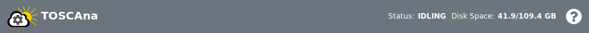

# WebApp

This guide explains how you can use the web app to create transformations.
If you are using TOSCAna like described in [Getting Started](../getting-started.md) the WebApp application is already started and ready to use.

## The start page

*The start page without any CSARs*

This page shows the default state of the app if no CSARs were added previously.

## The top bar

*The topbar*

**Status:** The status shows the current state of the TOSCAna transformer, idling means he has nothing to do.
If he is processing a transformation the status is _TRANSFORMING_.

**Disk Space:** Disk space shows how much server disk space is left.

## CSARs

### How to add a CSAR
**1. Step:** Click on the  button.
After clicking on the button the app should look like in the image below.

**2. Step:** Enter a name. If you leave the name empty and directly go to **Step 3** the name is automatically filled in.
If the name is a duplicate or something else is wrong the input field and the display indicator will be red.
Hovering over the indicator will show the reason why the name is wrong.

**3. Step:** Click on the **Select file** button to upload a CSAR.

**4. Step:** Submit the CSAR.

### How to view a CSAR

To view a CSAR click on it in the sidebar.
After clicking, the web app should look similar to the image below.
The current selected CSAR is highlighted blue in the sidebar.

  
*CSAR view for the lamp-input CSAR*

**Phases:** For each processing phase, the web app shows its status.  
**Log:** If something went wrong you might want to check the server logs on the bottom right of the screen.
With the *log level selector* you can filter unwanted log levels.

### How to delete a CSAR

To delete a CSAR click on the trash bin next to the CSAR name in the sidebar.

  

## Transformations

### How to add a transformation

**Step 1:** Click on the `+` button at the CSAR which you want to create a transformation for.

  

**Step 2:** Select a platform from the list shown below.

  
*Pick a platform*

If a transformation for this platform already exists the web app will ask you if you want to overwrite it.

**Step 3:** Enter the required inputs
  
*Enter the inputs the web app asks you for*

The web asks your for inputs TOSCAna needs to transform your CSAR.
If a input field is highlighted red it means that it is required or that it is wrong.
To get more information about an specific input you can hover over the info icon.

**Important:** To get more information about the inputs check the documentation of the platform you want to transform to.

**Step 4**: Click on the *Transform* button.   
*If you can not click the button something in **Step 3** went wrong.*

After clicking on the button the transformation view gets visible.
To learn more about the transformation view just keep scrolling.

### How to view a transformation

In the sidebar click on the CSAR and then on the transformation you want to look at.
After doing this the web app should look similar to the image below.
Also notice the selected transformation is highlighted orange in the sidebar.

**Phases:** The web app shows each transformation phases state.   
**Log:** If something went wrong you might want to check the server logs in the lower part of the web app.
With the *log level selector* you can filter unwanted log levels.

The transformation view looks very similar to the CSAR view but additionally there are two download buttons and the input and output tabs.

**Inputs:** If you click on the inputs tab you can see the values you entered for the inputs while you created a transformation.  
**Outputs:** The outputs tab shows the outputs defined in the service template of the CSAR.
Not every plugin can produce outputs so the values might be empty.

**Download artifact:** The *Download artifact* button provides the download of the whole artifact created during the transformation.  
**Download run script:** The *Download run script* button provides a script that downloads the artifact, unzips it and starts the deployment.
It can be run like that: `bash run.sh`.

### How to delete a transformation

To delete a transformation just click on the trash bin next to the transformation name in the sidebar.

  
*Click on the trash bin on the Kubernetes transformation to delete it*

